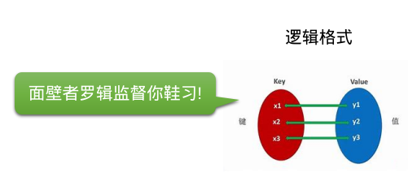
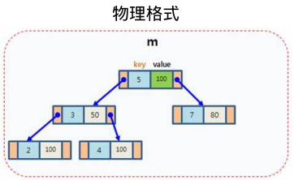
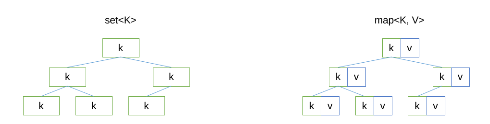

<!-- PG1 -->

<!-- 如何自动更新页码号：先 :source .vim_localrc，然后 :call MarkPG() -->

<!-- 本课程基于 CC-BY-NC-SA 协议发布，转载需标注出处，不得用于商业用途 -->

# 小彭老师 深入浅出 STL 课程系列 之 map

让高性能数据结构惠及每一人

---
layout: two-cols
---

<!-- PG2 -->

# 课程简介

😀😀😀

面向已经了解一定 C++ 语法，正在学习标准库的童鞋。

C++ 标准库又称 STL，包含了大量程序员常用的算法和数据结构，是 Bjarne Stroustrup 送给所有 C++ 程序员的一把瑞士军刀，然而发现很多童鞋并没有完全用好他，反而还被其复杂性误伤了。

如果你也对标准库一知半解，需要系统学习的话，那么本课程适合你。小彭老师将运用他特有的幽默答辩比喻，全面介绍各 STL 容器的所有用法。结合一系列实战案例，剖析常见坑点，使用技巧等。对比不同写法的性能与可读性，还会与 Python 语言相互类比方便记忆，科普的部分冷知识可以作为大厂面试加分项。

::right::

<center><p class="opacity-50">本课程受到童鞋一致好评</p></center>

---

<!-- PG3 -->

# 课程亮点

👍👍👍

本系列课程与《侯杰老师 STL 课》的区别：

- 侯杰老师价值 2650 元，本课程录播上传 B 站免费观看，观众可以自行选择是否一键三连。
- 课件和案例源码开源，上传在 GitHub，可以自己下载来做修改，然后自己动手实验，加深理解。
- 侯杰老师注重理论和底层实现原理，而本课程注重应用，结合实战案例，着重展开重难点，坑点等。
- 很多学校里教的，百度上搜的，大多是老版本 C++，已经过时，而本课程基于较新的 C++17 和 C++20 标准。
- 有时存在部分 C++ 高级用法过于艰深，不能适合所有同学，本课程采用因材施教思想：对于新手，可以跳过看不懂的部分，看我提供的“保底用法”，不保证高性能和“优雅”，但至少能用；对学有余力的童鞋，则可以搏一搏上限，把高级用法也看懂，提升面试竞争力。总之不论你是哪个阶段的学习者，都能从此课程中获益。

---

<!-- PG4 -->

# 课程大纲

✨✨✨

之前几期课程的录播已经上传到比站了[^1]。

1. vector 容器初体验 & 迭代器入门 (BV1qF411T7sd)
2. 你所不知道的 set 容器 & 迭代器分类 (BV1m34y157wb)
3. string，string_view，const char * 的爱恨纠葛 (BV1ja411M7Di)
4. 万能的 map 容器全家桶及其妙用举例 (本期)
5. 函子 functor 与 lambda 表达式知多少
6. 通过实战案例来学习 STL 算法库
7. C++ 标准输入输出流 & 字符串格式化
8. traits 技术，用户自定义迭代器与算法
9. allocator，内存管理与对象生命周期
10. C++ 异常处理机制的前世今生

[^1]: https://space.bilibili.com/263032155

---

<!-- PG5 -->

# 实验环境

✅✅✅

课件中所示代码推荐实验环境如下：

| 要求     | ❤❤❤        | 💣💣💣       | 💩💩💩         |
|----------|------------|--------------|----------------|
| 操作系统 | Arch Linux | Ubuntu 20.04 | Wendous 10     |
| 知识储备 | 会一点 C++ | 大学 C 语言  | Java 面向对象  |
| 编译器   | GCC 9 以上 | Clang 12     | VS 2019        |
| 构建系统 | CMake 3.18 | 任意 C++ IDE | 命令行手动编译 |

❤ = 推荐，💣 = 可用，💩 = 困难

---

<!-- PG6 -->

# 如何使用课件

🥰🥰🥰

本系列课件和源码均公布在：https://github.com/parallel101/course

例如本期的课件位于 `course/stlseries/stl_map/slides.md`。

课件基于 Slidev[^1] 开发，Markdown 格式书写，在浏览器中显示，在本地运行课件需要 Node.js：

- 运行命令 `npm install` 即可自动安装 Slidev
- 运行命令 `npm run dev` 即可运行 Slidev 服务
- 浏览器访问 http://localhost:3030 即可看到课件

如果报错找不到 `slidev` 命令，可以试试 `export PATH="$PWD/node_modules/.bin:$PATH"`。

如果不想自己配置 Node.js 也可以直接以文本文件格式打开 slides.md 浏览课件。

Slidev 服务运行时，你对 slides.md 的所有修改会立刻实时显现在浏览器中。

[^1]: https://sli.dev/

---

<!-- PG7 -->

# 如何运行案例代码

🥺🥺🥺

案例源码和所需头文件位于课件同目录的 `course/stlseries/stl_map/experiment/` 文件夹下。

其中 `main.cpp` 仅导入运行案例所需的头文件，具体各个案例代码分布在 slides.md 里。

如需测试课件中的具体代码，可以把 slides.md 中的案例代码粘贴到 main.cpp 的 main 函数体中进行实验。

此外为了方便，还有一些形如 `testxxx.cpp` 的文件是一些完整的测试案例，不用从 slides.md 中拷贝，可直接单独运行。

所需头文件都在同一个目录，可以通过 CMake 构建，也可以用任意自己喜欢的 IDE 单文件编译运行，无强制要求。

---

<!-- PG8 -->

附赠了一些实用头文件，同鞋们可以下载来研究，或者在自己的项目里随意运用。

<font size="3px">

| 文件名 | 功能 |
|-|-|
| print.h | 内含 print 函数，支持打印绝大多数 STL 容器，方便调试 |
| cppdemangle.h | 获得类型的名字，以模板参数传入，详见该文件中的注释 |
| map_get.h | 带默认值的 map 表项查询，稍后课程中会介绍到 |
| ScopeProfiler.h | 基于 RAII 的函数耗时统计，用于测量性能 |
| ppforeach.h | 基于宏的编译期 for 循环实现，类似于 BOOST_PP_FOREACH |
| bits_stdc++.h | 仿照 bits/stdc++.h 的万能头文件跨平台版，一次性导入所有库 |
| utf8.h | UTF-8 的编码与解码，u8string 和 u32string 互相转换 |
| hash.h | 比 std::hash 更通用的 generic_hash 实现，支持任意区间和元组 |

</font>

---

<!-- PG9 -->

# 课程书写习惯说明

```cpp
int const &i  // 本课程书写习惯
const int& i  // 官方文档书写习惯
```

```cpp
template <class T>     // 本课程书写习惯
template <typename T>  // 官方文档书写习惯
```

仅为个人书写习惯不同，在 C++ 编译器看来都是等价的。

---

<!-- PG10 -->

仅为教学方便目的，不建议在现实工程中使用：

```cpp
using namespace std;
```

本课程中的 `std::` 前缀均省略不写：

```cpp
map<string, vector<int>> m;
erase_if(m, pred);
```

现实工程中不建议 `using namespace std`，请显式写出 `std::` 前缀：

```cpp
std::map<std::string, std::vector<int>> m;
std::erase_if(m, pred);
```

---

<!-- PG11 -->

案例代码中用了仿照 `<bits/stdc++.h>` 的万能头文件，同样不建议在现实工程中使用：

```cpp
#include "bits_stdc++.h"
```

现实工程中，建议根据需要一个个导入，不要偷懒用这个不标准的头文件：

```cpp
#include <map>            // 导入 std::map, std::multimap
#include <unordered_map>  // 导入 std::unordered_map，std::unordered_multimap
#include <string>         // 导入 std::string, std::wstring
#include <algorithm>      // 导入 std::set_difference, std::set_union, std::set_intersection 等一系列全局函数
// 下面代码中用到哪些容器，就导入哪些头文件
```

[^1]: https://blog.csdn.net/m0_51755720/article/details/121489644

---

<!-- PG12 -->

# 本期课程目录

---

<!-- PG13 -->

关于算法复杂度，一个真实的小故事

有一次一个同学发给我一份源码文件 tetreader.py，其功能是读取一个 tet 格式的文件（四面体网格模型）。

他问我为什么他写的这个 Python 代码这么慢，读取一个稍微大一点的模型就需要好几秒，他说久仰小彭老师性能优化的大名，想要我帮他优化一下，还问是不是应该用 C++ 写会比较高效一点？

我并不懂得四面体，但性能优化的思路是通用的。我打开文件看了一下，我发现他读取时需要查询一个点周围所有的面，他是这样查询的：

```python
face_lut = []
# ...
face_lut.append(vert_id)
# ...
face_id = face_lut.index(vert_id)
```

我说你这个 face_lut 是个普通数组，数组的 index 函数是 $O(N)$ 复杂度的你不知道吗？他相当于暴力遍历了数组找到你需要的值，你这个 index 的调用还是在一个循环里的，所以是 $O(N^2)$ 复杂度！难怪这么慢了。

---

<!-- PG14 -->

后来我给他改了一下，把他的 face_lut 改成字典，用字典查找，高效得多了：

```python
face_lut = []
# ...
face_lut[vert_id] = face_id
# ...
face_id = face_lut[vert_id]
```

一次字典的查询只需要 $O(1)+$，所以加上他外面的循环总共只有 $O(N)$，变成线性复杂度了。他一试，果然几毫秒就加载完了，我说用字典加速查找这不是常识吗？还搁着 C++ 你就是 CUDA 来了也压不住复杂度爆表呀？

他很高兴，不知道怎么感谢我，于是就把我推荐给张心欣了。

---

<!-- PG15 -->

C++ 中也是如此，有数组（vector），字典（map），还有上一课讲过的集合（set）。

今天我们要介绍的就是 C++ 的字典容器 map，以及 C++11 引入的另一个字典容器 unordered_map，他们的异同我们稍后会详细讨论。

- 在 vector 容器用 std::find 查找：$O(N)$
- 在 map 或 set 容器用 .find 查找：$O(\log N)$
- 在 unordered_map 或 unordered_set 容器用 .find 查找：$O(1)+$

---

<!-- PG16 -->

map 的逻辑结构



特点：

- 由一系列*键值对*组成
- 一个键只能对应一个值
- 键不得重复，值可以重复

<br/>

> std::map, std::unordered_map, absl::flat_hash_map, tbb::concurrent_hash_map 都满足这一基本逻辑结构，但物理实现不同。

---

<!-- PG17 -->

标准库中的 map 容器[^1]

标准库中，map 是一个模板类，他的键类型，值类型，可以由尖括号内的参数指定。

键类型和值类型可以是任意类型，包括基本类型，用户自定义的类，或是其他 STL 容器等。

- 例如 `map<string, int>` 是一个键类型为 string，值类型为 int 的 map 容器。
- 例如 `map<int, Student>` 是一个键类型为 int，值类型为 Student 的 map 容器。
- 例如 `map<char, vector<int>>` 是一个键类型为 char，值类型为 `vector<int>` 的 map 容器。

后面为了方便研究，以 `map<K, V>` 形式书写得出的结论，对于任何实际键和值类型，只需代入 K 和 V 即可。

> 已知：要想使用 `map<K, V>`，就得满足 `K` 必须支持比较运算符 `<`。
>
> 可得：要想使用 `map<string, int>`，就得满足 `string` 必须支持比较运算符 `<`[^2]。
>
> 已知：遍历 `map<K, V>` 时，是以键 `K` 部分从小到大的顺序遍历的。
>
> 可得：遍历 `map<int, string>` 时，是以键 `int` 部分从小到大的顺序遍历的。

[^1]: https://en.cppreference.com/w/cpp/container/map
[^2]: `std::string` 的大小比较规则可以回顾 BV1ja411M7Di 和 BV1m34y157wb 这两节课

---

<!-- PG18 -->

map 的物理结构



map 和 set 一样，都是基于红黑树的二叉排序树，实现高效查找。

vector 就是因为元素没有固定的顺序，所以才需要暴力遍历查找。

在持续的插入和删除操作下，始终维持元素的有序性，正是 map 实现高效查找的关键所在。

---

<!-- PG19 -->

map 查找时采用二分法：

1. 从根节点开始查找。

2. 如果当前节点的键小于要找的键，则往左子节点移动；

3. 如果当前节点的键大于要找的键，则往左子节点移动；

4. 如果当前节点的键等于要找的键，则该节点就是要找的节点，返回该节点。

5. 把左/右子节点设为新的当前节点，然后回到第 2 步，重复这一查找过程。

---

<!-- PG20 -->

由于 map 的实现基于二叉排序树，map 额外有一个特点：*有序*。

map (或 set) 中的键 K 总是从小到大排列，方便进行二分查找，在 $O(\log N)$ 时间内找到对应元素。

每次插入新的键时，会找到适当的插入位置，使得插入后的 map 仍然有序。

> 注：基于哈希散列表实现的 unordered_map (和 unordered_set)，就不具备*有序*这一特点。


---

<!-- PG21 -->



两者的区别在于：map 在 K 之外，额外外挂了一个 V 类型。

map 中的 V 类型不参与排序，只按照 K 进行排序。

这样当用户根据 K 找到的是 K-V 对，然后可以取出 K 对应的 V。

这就实现了从 K 到 V 的映射。

---

<!-- PG22 -->

创建一个 map 对象：

```cpp
map<string, int> config;
```

一开始 map 初始是空的，如何插入一些初始数据？

```cpp
config["timeout"] = 985;
config["delay"] = 211;
```

数据插入成功了，根据键查询对应的值？

```cpp
print(config["timeout"]);
print(config["delay"]);
```

查询时建议用 .at(key) 而不是 [key]：

```cpp
print(config.at("timeout"));
print(config.at("delay"));
```

---

<!-- PG26 -->

老生常谈的问题：map 中存 string 还是 const char *？

```cpp
map<const char *, const char *> m;
m["hello"] = "old";    // 常量区的 "hello"
char key[] = "hello";
m[key] = "new";        // 栈上变量的 key = "hello"
print(m);
print(key == "hello"); // false
```

```
{hello: old, hello: new}
false
```

在 C++ 中，任何时候都务必用 string！别用 C 语言老掉牙的 const char *，太危险了。

const char * 危险的原因：

1. const char * 的 == 判断的是指针的相等，两个 const char * 只要地址不同，即使实际的字符串相同，也不会被视为同一个元素（如上代码案例所示）。导致 map 里会出现重复的键，以及按键查找可能找不到等。
2. 保存的是弱引用，如果你把局部的 char [] 或 string.c_str() 返回的 const char * 存入 map，等这些局部释放了，map 中的 const char * 就是一个空悬指针了，会造成 segfault。

---

请用安全的 string：

```cpp
map<string, string> m;
m["hello"] = "old";
string key = "hello";
m[key] = "new";
print(m);
print(key == "hello");
```

```
{"hello": "new"}
true
```

---

即使你精通对象生命周期分析，能保证 key 指向的字符串活的比 m 久，也请用封装了正确 == 运算符的 string_view：

```cpp
map<string_view, string_view> m;
m["hello"] = "old";
string_view key = "hello";
m[key] = "new";
print(m);
print(key == "hello");
// 此处 m 是栈上变量，key 是弱引用指向全局常量区（rodata），key 比 m 活得久，没有空悬指针问题
```

```
{"hello": "new"}
true
```

<br/>

> 注：map 实际上用到的是 &lt; 运算符。

---

<!-- PG23 -->

C++11 新特性——花括号初始化列表，允许创建 map 时直接指定初始数据：

```cpp
map<string, int> config = { {"timeout", 985}, {"delay", 211} };
```

通常我们会换行写，一行一个键值对，看起来条理更清晰：

```cpp
map<string, int> config = {
    {"timeout", 985},
    {"delay", 211},
};

print(config.at("timeout"));  // 985
```

---

总结花括号初始化语法：

```cpp
map<K, V> m = {
    {k1, v1},
    {k2, v2},
    ...,
};
```

让 map 初始就具有这些数据。

---

<!-- PG24 -->

```cpp
map<string, int> config = {
    {"timeout", 985},
    {"delay", 211},
};
```

等号可以省略（这其实相当于是在调用 map 的构造函数）：

```cpp
map<string, int> config{
    {"timeout", 985},
    {"delay", 211},
};
```

也可以先构造再赋值给 auto 变量：

```cpp
auto config = map<string, int>{
    {"timeout", 985},
    {"delay", 211},
};
```

都是等价的。

> 关于构造函数、花括号列表的具体语法可以参考我的《高性能并行》系列第二课：https://www.bilibili.com/video/BV1LY411H7Gg

---

<!-- PG25 -->

作为函数参数时，可以用花括号初始化列表就地构造一个 map 对象：

```cpp
void myfunc(map<string, int> config);  // 函数声明

myfunc(map<string, int>{               // 直接创建一个 map 传入
    {"timeout", 985},
    {"delay", 211},
});
```

由于 `myfunc` 函数具有唯一确定的重载，要构造的参数类型 `map<string, int>` 可以省略不写：

```cpp
myfunc({
    {"timeout", 985},
    {"delay", 211},
});
```

函数这边，通常还会加上 `const &` 修饰避免不必要的拷贝。

```cpp
void myfunc(map<string, int> const &config);
```

---

<!-- PG27 -->

从 vector 中批量导入键值对：

```cpp
vector<pair<string, int>> kvs = {
    {"timeout", 985},
    {"delay", 211},
};
map<string, int> config(kvs.begin(), kvs.end());
```

与刚刚花括号初始化的写法等价，只不过是从现有的 vector 中导入。同样的写法也适用于从 array 导入。

> 如果记不住这个写法，也可以自己手写 for 循环遍历 vector 逐个逐个插入 map，效果是一样的。

冷知识，如果不是 vector 或 array，而是想从传统的 C 语言数组中导入：

```cpp
pair<string, int> kvs[] = {  // C 语言原始数组
    {"timeout", 985},
    {"delay", 211},
};
map<string, int> config(kvs, kvs + 2);                    // C++98
map<string, int> config(std::begin(kvs), std::end(kvs));  // C++17
```

> 其中 `std::begin` 和 `std::end` 为 C++17 新增函数，专门用于照顾没法有成员函数 `.begin()` 的 C 语言数组。类似的全局函数还有 `std::size` 和 `std::data` 等……他们都是既兼容 STL 容器也兼容 C 数组的。

---

<!-- PG28 -->

如何根据键查询相应的值？

很多同学都知道 map 具有 [] 运算符重载，和一些脚本语言一样，直观易懂。

```cpp
config["timeout"] = 985;       // 把 config 中键 timeout 对应值设为 985
auto val = config["timeout"];  // 读取 config 中键 timeout 对应值
print(val);                    // 985
```

但其实用 [] 访问元素是很不安全的，下面我会做实验演示这一点。

---

<!-- PG29 -->

沉默的 []，无言的危险：当键不存在时，会返回 0 而不会出错！

```cpp
map<string, int> config = {
    {"timeout", 985},
    {"delay", 211},
};
print(config["timeout"]); // 985
print(config["tmeout"]);  // 默默返回 0
```

```
985
0
```

当查询的键值不存在时，[] 会默默创建并返回 0。

这非常危险，例如一个简简单单的拼写错误，就会导致 map 的查询默默返回 0，你还在那里找了半天摸不着头脑，根本没发现错误原来在 map 这里。

---

<!-- PG30 -->

爱哭爱闹的 at()，反而更讨人喜欢

```cpp
map<string, int> config = {
    {"timeout", 985},
    {"delay", 211},
};
print(config.at("timeout"));  // 985
print(config.at("tmeout"));   // 该键不存在！响亮地出错
```

```
985
terminate called after throwing an instance of 'std::out_of_range'
  what():  map::at
Aborted (core dumped)
```

有经验的老手都明白一个道理：**及时奔溃**比**容忍错误**更有利于调试。即 fail-early, fail-loudly[^1] 原则。

例如 JS 和 Lua 的 [] 访问越界不报错而是返回 undefined / nil，导致实际出错的位置在好几十行之后，无法定位到真正出错的位置，这就是为什么后来发明了错误检查更严格的 TS。

使用 at() 可以帮助你更容易定位到错误，是好事。

[^1]: https://oncodingstyle.blogspot.com/2008/10/fail-early-fail-loudly.html

---

<!-- PG31 -->

[] 更危险的地方在于，当所查询的键值不存在时：

```cpp
map<string, int> config = {
    {"timeout", 985},
    {"delay", 211},
};
print(config);
print(config["tmeout"]);  // 有副作用！
print(config);
```

```
{"delay": 211, "timeout": 985}
0
{"delay": 211, "timeout": 985, "tmeout": 0}
```

会自动创建那个不存在的键值！

你以为你只是观察了一下 map 里的 "tmeout" 元素，却意外改变了 map 的内容，薛定谔[^1]直呼内行。

[^1]: https://baike.baidu.com/item/%E8%96%9B%E5%AE%9A%E8%B0%94%E7%9A%84%E7%8C%AB/554903

---

<!-- PG32 -->

> 在官方文档和各种教学课件中，都会展示一个函数的“原型”来讲解。
>
> 原型展现了一个函数的名称，参数类型，返回类型等信息，掌握了函数的原型就等于掌握了函数的调用方法。
>
> 本课程后面也会大量使用，现在来教你如何看懂成员函数的原型。

假设要研究的类型为 `map<K, V>`，其中 K 和 V 是模板参数，可以替换成你具体的类型。

例如当我使用 `map<string, int>` 时，就把下面所有的 K 替换成 string，V 替换成 int。

`map<K, V>` 的 [] 和 at 员函数，原型如下：

```cpp
V &operator[](K const &k);
V &at(K const &k);                   // 第一个版本的 at
V const &at(K const &k) const;       // 第二个版本的 at
```

可见 operator[] 只有一个版本，at 居然有名字相同的两个！这样不会发生冲突吗？

这是利用了 C++ 的“重载”功能，重载就是同一个函数有多个不同的版本，各个版本的参数类型不同。

---

<!-- PG33 -->

> 例如小彭老师打电话给 110，假如警察叔叔发现小彭老师报的案子是网络诈骗，那么他们会帮我转接到网警部门；假如发现小彭老师是被绑架了，那么他们可能会出动武警解救小彭老师。这就是 110 函数的两个重载，根据调用者传入的信息类型，决定要转给哪一个子部门。

同理，编译器也是会根据调用时你传入的参数类型，决定要调用重载的哪一个具体版本。

- C 语言没有重载，函数名字相同就会发生冲突，编译器会当场报错。
- C++ 支持重载，只有当函数名字相同，参数列表也相同时，才会发生冲突。
- 返回值类型不影响重载，重载只看参数列表。

菜鸟教程上对 C++ 重载的解释[^1]：

> C++ 允许在同一作用域中的某个函数和运算符指定多个定义，分别称为函数重载和运算符重载。
>
> 重载声明是指一个与之前已经在该作用域内声明过的函数或方法具有相同名称的声明，但是它们的参数列表和定义（实现）不相同。
>
> 当您调用一个重载函数或重载运算符时，编译器通过把您所使用的参数类型与定义中的参数类型进行比较，决定选用最合适的定义。选择最合适的重载函数或重载运算符的过程，称为重载决策。
>
> 在同一个作用域内，可以声明几个功能类似的同名函数，但是这些同名函数的形式参数（指参数的个数、类型或者顺序）必须不同。您不能仅通过返回类型的不同来重载函数。

[^1]: https://www.runoob.com/cplusplus/cpp-overloading.html

---

<!-- PG34 -->

```cpp
V &at(K const &k);                   // 第一个版本的 at
V const &at(K const &k) const;       // 第二个版本的 at
```

但是上面这两个 at 函数的参数类型都是 `K const &`，为什么可以重载呢？

注意看第二个版本最后面多了一个 const 关键字，这种写法是什么意思？小彭老师对其进行祛魅化：

```cpp
V &at(map<K, V> *this, K const &k);                   // 第一个版本的 at
V const &at(map<K, V> const *this, K const &k);       // 第二个版本的 at
```

原来实际上在函数括号后面加的 const，实际上是用于修饰 this 指针的！

> 该写法仅供示意，并非真实语法

所以两个 at 的参数列表不同，不同在于传入 this 指针的类型，所以可以重载，不会冲突。

- 当 map 对象为 const 时，传入的 this 指针为 `map<K, V> const *`，所以只能调用第二个版本的 at。
- 当 map 对象不为 const 时，传入的 this 指针为 `map<K, V> *`，两个重载都可以调用，但由于第一个重载更加符合，所以会调用第一个版本的 at。

---

<!-- PG35 -->

刚刚解释了函数重载，那么运算符重载呢？

因为原本 C 语言就有 [] 运算符，不过那只适用于原始指针和原始数组。而 C++ 允许也 [] 运算符支持其他用户自定义类型（比如 std::map），和 C 语言自带的相比就只有参数类型不同（一个是原始数组，一个是 std::map），所以和函数重载很相似，这就是运算符重载。

```cpp
m["key"];
```

会被编译器“翻译”成：

```cpp
m.operator[]("key");
```

以上代码并非仅供示意，是可以通过编译运行之一。你还可以试试 `string("hel").operator+("lo")`。

> operator[] 虽然看起来很复杂一个关键字加特殊符号，其实无非就是个特殊的函数名，学过 Python 的童鞋可以把他想象成 `__getitem__`

```cpp
V &operator[](K const &k);
```

结论：[] 运算符实际上是在调用 operator[] 函数。

---

<!-- PG36 -->

而 operator[] 这个成员函数没有 const 修饰，因此当 map 修饰为 const 时编译会不通过[^1]：

```cpp
const map<string, int> config = {  // 此处如果是带 const & 修饰的函数参数也是同理
    {"timeout", 985},
    {"delay", 211},
};
print(config["timeout"]);          // 编译出错
```

```
/home/bate/Codes/course/stlseries/stl_map/experiment/main.cpp: In function ‘int main()’:
/home/bate/Codes/course/stlseries/stl_map/experiment/main.cpp:10:23: error: passing ‘const std::map<std::__cxx11::basic_string<char>, int>’ as ‘this’ argument discards qualifiers [-fpermissive]
   10 | print(config["timeout"]);
```

编译器说 discards qualifiers，意思是 map 有 const 修饰，但是 operator[] 没有。

这实际上就是在说：`map<K, V> const *` 不能转换成 `map<K, V> *`。

有 const 修饰的 map 作为 this 指针传入没 const 修饰的 operator[] 函数，是减少了修饰（discards qualifers）。C++ 规定传参时只能增加修饰不能减少修饰：只能从 `map *` 转换到 `map const *` 而不能反之，所以对着一个 const map 调用非 const 的成员函数 operator[] 就出错了。相比之下 at() 就可以在 const 修饰下编译通过。

[^1]: https://blog.csdn.net/benobug/article/details/104903314

---

<!-- PG37 -->

既然 [] 这么危险，为什么还要存在呢？

```cpp
map<string, int> config = {
    {"delay", 211},
};
config.at("timeout") = 985;  // 键值不存在，报错！
config["timeout"] = 985;     // 成功创建并写入 985
```

因为当我们写入一个本不存在的键值的时候，恰恰需要他的“自动创建”这一特性。

总结：读取时应该用 at() 更安全，写入时才需要用 []。

---

<!-- PG38 -->

- 读取元素时，统一用 at()
- 写入元素时，统一用 []

```cpp
auto val = m.at("key");
m["key"] = val;
```

为什么其他语言比如 Python，只有一个 [] 就行了呢？而 C++ 需要两个？

- 因为 Python 会检测 [] 位于等号左侧还是右侧，根据情况分别调用 `__getitem__` 或者 `__setitem__`。
- C++ 编译器没有这个特殊检测，也检测不了，因为 C++ 的 [] 只是返回了个引用，并不知道 [] 函数返回以后，你是拿这个引用写入还是读取。为了保险起见他默认你是写入，所以先帮你创建了元素，返回这个元素的引用，让你写入。
- 而 Python 的引用是不能用 = 覆盖原值的，那样只会让变量指向新的引用，只能用 .func() 引用成员函数或者 += 才能就地修改原变量，这是 Python 这类脚本语言和 C++ 最本质的不同。
- 总而言之，我们用 C++ 的 map 读取元素时，需要显式地用 at() 告诉编译器我是打算读取。

---

<!-- PG39 -->

```cpp
print(config.at("hello"));  // "world"
print(config.at("hello"));  // "kitty"
```

---

<!-- PG40 -->

at 与 [] 实战演练

我们现在的甲方是一个学校的大老板，他希望让我们管理学生信息，因此需要建立一个映射表，能够快速通过学生名字查询到相应的学生信息。思来想去 C++ 标准库中的 map 容器最合适。决定设计如下：

- 键为学生的名字，string 类型。
- 值为一个自定义结构体，Student 类型，里面存放各种学生信息。

然后自定义一下 Student 结构体，现在把除了名字以外的学生信息都塞到这个结构体里。

创建 `map<string, Student>` 对象，变量名为 `stus`，这个 map 就是甲方要求的学生表，成功交差。

```cpp
struct Student {
    int id;             // 学号
    int age;            // 年龄
    string sex;         // 性别
    int money;          // 存款
    set<string> skills; // 技能
};

map<string, Student> stus;
```

---

<!-- PG41 -->

现在小彭老师和他的童鞋们要进入这家学校了，让我们用 [] 大法插入他的个人信息：

```cpp
stus["彭于斌"] = Student{20220301, 22, "自定义", {"C", "C++"}};
stus["相依"] = Student{20220301, 21, "男", 2000, {"Java", "C"}};
stus["樱花粉蜜糖"] = Student{20220301, 20, "女", 3000, {"Python", "CUDA"}};
stus["Sputnik02"] = Student{20220301, 19, "男", 4000, {"C++"}};
```

由于 C++11 允许省略花括号前的类型不写，所以 Student 可以省略，简写成：

```cpp
stus["彭于斌"] = {20220301, 22, "自定义", {"C", "C++"}};
stus["相依"] = {20220301, 21, "男", 2000, {"Java", "C"}};
stus["樱花粉蜜糖"] = {20220301, 20, "女", 3000, {"Python", "CUDA"}};
stus["Sputnik02"] = {20220301, 19, "男", 4000, {"C++"}};
```

又由于 map 支持在初始化时就指定所有元素，我们直接写：

```cpp
map<string, Student> stus = {
    {"彭于斌", {20220301, 22, "自定义", 1000, {"C", "C++"}}},
    {"相依", {20220301, 21, "男", 2000, {"Java", "C"}}},
    {"樱花粉蜜糖", {20220301, 20, "女", 3000, {"Python", "CUDA"}}},
    {"Sputnik02", {20220301, 19, "男", 4000, {"C++"}}},
};
```

---

<!-- PG42 -->

现在甲方要求添加一个“培训”函数，用于他们的 C++ 培训课。

培训函数的参数为字符串，表示要消费学生的名字。如果该名字学生不存在，则应该及时报错。

每次培训需要消费 2650 元，消费成功后，往技能 skills 集合中加入 "C++"。

```cpp
void PeiXunCpp(string stuName) {
    auto stu = stus.at(stuName);  // 在栈上拷贝了一份完整的 Student 对象
    stu.money -= 2650;
    stu.skills.insert("C++");
}
```

然而，这样写是不对的！

`stus.at(stuName)` 返回的是一个引用 `Student &`，但是等号左侧，却不是个引用，而是普通变量。

那么这时会调用 Student 的拷贝构造函数，`Student(Student const &)`，来初始化变量 stu。

结论：把引用保存到普通变量中，则引用会退化，造成深拷贝！stu 和 stus.at(stuName) 的已经是两个不同的 Student 对象，对 stu 的修改不会影响到 stus.at(stuName) 指向的那个 Student 对象了。


此时你对这个普通变量的所有修改，都不会同步到 map 中的那个 Student 中去！

---

<!-- PG43 -->

我们现在对相依童鞋进行 C++ 培训：

```cpp
PeiXunCpp("相依");
print(stus.at("相依"));
```

结果发现他的存款一分没少，也没学会 C++：

```
{id: 20220302, age: 21, sex: "男", money: 2000, skills: {"C", "Java"}}
```

看来我们的修改没有在 map 中生效？原来是因为我们在 PeiXunCpp 函数里：

```cpp
auto stu = stus.at(stuName);  // 在栈上拷贝了一份完整的 Student 对象
```

一不小心就用了“克隆人”技术！从学生表里的“相依1号”，克隆了一份放到栈上的“相依2号”！

然后我们扣了这个临时克隆人“相依2号”的钱，并给他培训 C++ 技术。

然而我们培训的是栈上的临时变量“相依2号”，克隆前的“相依1号”并没有受到培训，也没有扣钱。

然后呢？残忍的事情发生了！在小彭老师一通操作培训完“相依2号”后，我们把他送上断头台——析构了！

而这一切“相依1号”完全不知情，他只知道有人喊他做克隆，然后就回家玩 Java 去了，并没有培训 C++ 的记忆。

---

<!-- PG44 -->

要防止引用退化成普通变量，需要把变量类型也改成引用！这种是浅拷贝，stu 和 stus.at(stuName) 指向的仍然是同一个 Student 对象。用 `auto` 捕获的话，改成 `auto &` 就行。

```cpp
void PeiXunCpp(string stuName) {
    auto &stu = stus.at(stuName);  // 在栈上创建一个指向原 Student 对象的引用
    stu.money -= 2650;
    stu.skills.insert("C++");
}
```

```
{id: 20220302, age: 21, sex: "男", money: -650, skills: {"C", "C++", "Java"}}
```

终于，正版“相依1号”本体鞋废了 C++！

之后如果再从“相依1号”身上克隆，克隆出来的“相依n号”也都会具有培训过 C++ 的记忆了。

引用相当于身份证，我们复印了“相依”的身份证，身份证不仅复印起来比克隆一个大活人容易（拷贝开销）从而提升性能，而且通过身份证可以找到本人，对身份证的修改会被编译器自动改为对本人的修改，例如通过“相依”的身份证在银行开卡等，银行要的是身份证，不是克隆人哦。

---

<!-- PG45 -->

引用是一个烫手的香香面包，普通变量就像一个臭臭的答辩马桶，把面包放到马桶（auto）里，面包就臭掉，腐烂掉，不能吃了！要让面包转移阵地了以后依然好吃，需要放到保鲜盒（auto &）里。

这就是 C++ 的 decay（中文刚好是“退化”、“变质”的意思）规则。

以下都是香香面包，放进马桶里会变质：

- `T &` 会变质成 `T`（引用变质成普通变量）
- `T []` 会变质成 `T *`（数组变质成首地址指针）
- `T ()` 会变质成 `T (*)()`（函数变质成函数指针）

在函数的参数中、函数的返回值中、auto 捕获的变量中，放入这些香香面包都会发生变质！

如何避免变质？那就不要用马桶（普通变量）装面包呗！用保鲜盒（引用）装！

- 避免引用 `T &t` 变质，就得把函数参数类型改成引用，或者用 `auto &`，`auto const &` 捕获才行。
- 避免原生数组 `T t[N]` 变质，也可以改成引用 `T (&t)[N]`，但比较繁琐，不如直接改用 C++11 封装的安全静态数组 `array<T, N>` 或 C++98 就有的安全动态数组 `vector<T>`。
- 避免函数 `T f()` 变质，可以 `T (&f)()`，但繁琐，不如直接改用 C++11 的函数对象 `function<T()>`。


---

<!-- PG46 -->

邪恶的 decay 规则造成空悬指针的案例

```cpp
typedef double arr_t[10];

auto func(arr_t val) {
    arr_t ret;
    memcpy(ret, val, sizeof(arr_t));  // 对 val 做一些运算, 把计算结果保存到 ret
    return ret;     // double [10] 自动变质成 double *
}

int main() {
    arr_t val = {1, 2, 3, 4};
    auto ret = func(val);             // 此处 auto 会被推导为 double *
    print(std::span<double>(ret, ret + 10));
    return 0;
}
```

```
Segmentation fault (core dumped)
```

---

<!-- PG47 -->

修复方法：不要用沙雕 C 语言的原生数组，用 C++ 封装好的 array

```cpp
typedef std::array<double, 10> arr_t;  // 或者 vector 亦可

auto func(arr_t val) {
    arr_t ret;
    ret = val;  // 对 val 做一些运算, 把计算结果保存到 ret
    return ret;
}

int main() {
    arr_t val = {1, 2, 3, 4};
    auto ret = func(val);
    print(ret);
    return 0;
}
```

```
{1, 2, 3, 4, 0, 0, 0, 0, 0, 0}
```

---

<!-- PG48 -->

当然如果你还是学不会怎么保留香香引用的话，也可以在修改后再次用 [] 写回学生表。这样学生表里不会 C++ 的“相依1号”就会被我们栈上培训过 C++ 的“相依1号”覆盖，现在学生表里的也是有 C++ 技能的相依辣！只不过需要翻来覆去克隆了好几次比较低效而已，至少能用了，建议只有学不懂引用的童鞋再用这种保底写法。

```cpp
void PeiXunCpp(string stuName) {
    auto stu = stus.at(stuName);  // 克隆了一份“相依2号”
    stu.money -= 2650;
    stu.skills.insert("C++");
    stus[stuName] = stu;          // “相依2号”夺舍，把“相依1号”给覆盖掉了
}
```

学生思考题：上面代码第 5 行也可以改用 at，为什么？小彭老师不是说 “at 用于读取，[] 用于写入” 吗？

我们童鞋要学会变通！小彭老师说 [] 用于写入，是因为有时候我们经常需要写入一个不存在的元素，所以 [] 会自动创建元素而不是出错就很方便；但是现在的情况是我们第 2 行已经访问过 at("相依")，那么就确认过 "相依" 已经存在才对，因此我写入的一定是个已经存在的元素，这时 [] 和 at 已经没区别了，所以用 at 的非 const 那个重载，一样可以写入。

我们童鞋不是去死记硬背《小彭老师语录》，把小彭老师名言当做“两个凡是”圣经。要理解小彭老师会这么说的原因是什么，这样才能根据不同实际情况，实事求是看问题，才是符合小彭老师唯物编程观的。

---

<!-- PG49 -->

如果要根据学号进行查找呢？那就以学号为键，然后把学生姓名放到 Student 结构体中。

如果同时有根据学号进行查找和根据姓名查找两种需求呢？

同时高效地根据多个键进行查找，甚至指定各种条件，比如查询所有会 C++ 的学生等，这可不是 map 能搞定的，或者说能搞定但不高效（只能暴力遍历查找，间复杂度太高）。这是个专门的研究领域，称为：关系数据库。

关系数据库的实现有 MySQL，SQLite，MongoDB 等。C++ 等编程语言只需调用他们提供的 API 即可，不必自己手动实现这些复杂的查找和插入算法。

这就是为什么专业的“学生管理系统”都会用关系数据库，而不是自己手动维护一个 map，因为关系数据库的数据结构更复杂，但经过高度封装，提供的功能也更全面，何况 map 在内存中，电脑一关机，学生数据就没了。

---

<!-- PG50 -->

查询 map 中元素的数量

```cpp
size_t size() const noexcept;
```

使用 `m.size()` 获得的 map 大小，或者说其中元素的数量。

```cpp
map<string, int> m;
print(m.size());
m["fuck"] = 985;
print(m.size());
m["dick"] = 211;
print(m.size());
```

---

<!-- PG51 -->

应用举例：给每个键一个独一无二的计数

```cpp
map<string, int> m;
m["fuck"] = m.size();
m["dick"] = m.size();
```

> 注：需要 C++17 保证等号右边先求值

---

<!-- PG52 -->

判断一个键是否存在：count 函数

```cpp
size_t count(K const &k) const;
```

count 返回容器中键和参数 k 相等的元素个数，类型为 size_t（无符号 64 位整数）。

由于 map 中同一个键最多只可能有一个元素，取值只能为 0 或 1。

并且 size_t 可以隐式转换为 bool 类型，0 则 false，1 则 true。

---

<!-- PG53 -->

因此可以直接通过 count 的返回值是否为 0 判断一个键在 map 中是否存在：

```cpp
map<string, string> msg = {
    {"hello", "world"},
    {"fuck", "rust"},
};
print(msg);
if (msg.count("fuck")) {
    print("存在fuck，其值为", msg.at("fuck"));
} else {
    print("找不到fuck");
}
if (msg.count("dick")) {
    print("存在dick，其值为", msg.at("suck"));
} else {
    print("找不到dick");
}
```

```
{"fuck": "rust", "hello": "world"}
存在fuck，其值为 "rust"
找不到dick
```

C++20 中还可以改用返回类型直接为 bool 的 contains 函数，满足你的命名强迫症。

```cpp
if (msg.contains("fuck")) {
    print("存在fuck，其值为", msg.at("fuck"));
} else {
    print("找不到fuck");
}
```

---

<!-- PG54 -->

你知道吗？[] 的妙用

除了写入元素需要用 [] 以外，还有一些案例中合理运用 [] 会非常的方便。

[] 的效果：当所查询的键值不存在时，会调用默认构造函数创建一个元素[^1]。

- 对于 int, float 等数值类型而言，默认值是 0。
- 对于指针（包括智能指针）而言，默认值是 nullptr。
- 对于 string 而言，默认值是空字符串 ""。
- 对于 vector 而言，默认值是空数组 {}。
- 对于自定义类而言，会调用你写的默认构造函数，如果没有，则每个成员都取默认值。

[^1]: https://en.cppreference.com/w/cpp/language/value_initialization

---

<!-- PG55 -->

[] 妙用举例：出现次数统计

```cpp
vector<string> input = {"hello", "world", "hello"};
map<string, int> counter;
for (auto const &key: input) {
    counter[key]++;
}
print(counter);
```

```
{"hello": 2, "world": 1}
```

---
layout: two-cols-header
---

<!-- PG56 -->

::left::

<center>

活用 [] 自动创建 0 元素的特性

</center>

```cpp {3}
map<string, int> counter;
for (auto const &key: input) {
    counter[key]++;
}
```

::right::

<center>

古板的写法

</center>

```cpp {3-7}
map<string, int> counter;
for (auto const &key: input) {
    if (!counter.count(key)) {
        counter[key] = 1;
    } else {
        counter[key] = counter.at(key) + 1;
    }
}
```

---

<!-- PG57 -->

[] 妙用举例：归类

```cpp
vector<string> input = {"happy", "world", "hello", "weak", "strong"};
map<char, vector<string>> categories;
for (auto const &str: input) {
    char key = str[0];
    categories[key].push_back(str);
}
print(categories);
```

```
{'h': {"happy", "hello"}, 'w': {"world", "weak"}, 's': {"strong"}}
```

---
layout: two-cols-header
---

<!-- PG58 -->

::left::

<center>

活用 [] 自动创建"默认值"元素的特性

</center>

```cpp {4}
map<char, vector<string>> categories;
for (auto const &str: input) {
    char key = str[0];
    categories[key].push_back(str);
}
print(categories);
```

::right::

<center>

古板的写法

</center>

```cpp {4-8}
map<char, vector<string>> categories;
for (auto const &str: input) {
    char key = str[0];
    if (!categories.count(key)) {
        categories[key] = {str};
    } else {
        categories[key].push_back(str);
    }
}
```

---
layout: center
---

<!-- PG59 -->


---

<!-- PG60 -->

反面典型：查找特定元素在 vector 中的位置（下标）

```cpp
size_t array_find(vector<string> const &arr, string const &val) {
    for (size_t i = 0; i < arr.size(); i++) {
        if (arr[i] == val) return i;
    }
    return (size_t)-1;
}
vector<string> arr = {"hello", "world", "nice", "day", "fucker"};
print("hello在数组中的下标是：", array_find(arr, "fucker"));    // O(N) 低效
print("nice在数组中的下标是：", array_find(arr, "nice"));       // O(N) 低效
```

每次调用 `array_find`，都需要 $O(N)$ 复杂度。

```
fucker在数组中的下标是：0
nice在数组中的下标是：2
```

如果查询 N 次，则复杂度就是 $O(N^2)$。

> 注：假设 vector 中不存在重复的元素

---

<!-- PG61 -->

正确做法：构建 vector 的反向查找表，以后查找更高效

```cpp
vector<string> arr = {"hello", "world", "nice", "day", "fucker"};
map<string, size_t> arrinv;
for (size_t i = 0; i < arr.size(); i++) {                // O(N) 一次性受苦
    arrinv[arr[i]] = i;
}
print("反向查找表构建成功：", arrinv);
print("fucker在数组中的下标是：", arrinv.at("fucker"));  // O(log N) 高效
print("nice在数组中的下标是：", arrinv.at("nice"));      // O(log N) 高效
```

只有第一次构造反向查找表时，需要 $O(N)$ 复杂度。

以后每次调用 `map.at`，只需要 $O(\log N)$ 复杂度。

```
反向查找表构建成功：{"day": 3, "fucker", 4, "hello": 0, "nice": 2, "world": 1}
fucker在数组中的下标是：4
nice在数组中的下标是：2
```

<!-- 轶事：在数据库这门学问中，这种反向查找表被称为“倒序索引”，小彭老师在不知道这个术语的情况下，独立产生了反向查找表的思想 -->

---

<!-- PG62 -->

```cpp
for (size_t i = 0; i < arr.size(); i++) {
    arrinv[arr[i]] = i;
}
```

提前构造好查找表 $O(N)$，以后每次查找只需要 $O(\log N)$ 复杂度就行。

- （正向查找）已知下标 i，求元素 v：`v = arr[i]`
- （反向查找）已知元素 v，求下标 i：`i = arrinv[v]`

如果查询 N 次，则复杂度就是 $O(N \log N)$，比优化前高效。

因此当需要多次查找且原数组保持不变时，强烈推荐用这种方法，更高效。

---

<!-- PG63 -->

案例：构建另一个 map 的反向查找表

```cpp
map<string, string> tab = {
    {"hello", "world"},
    {"fuck", "rust"},
};
map<string, string> tabinv;
for (auto const &[k, v]: tab) {
    tabinv[v] = k;
}
print(tabinv);
```

效果就是，键变值，值变键，反一反，两个 map 互为逆运算：

```
{"rust": "fuck", "world": "hello"}
```

注：假设 tab 中不存在重复的值，键和值一一对应

---

<!-- PG64 -->

STL 容器的元素类型都可以通过成员 `value_type` 查询，常用于泛型编程（又称元编程）。

```cpp
set<int>::value_type      // int
vector<int>::value_type   // int
string::value_type        // char
```

此外还有引用类型 `reference`，迭代器类型 `iterator`，常迭代器类型 `const_iterator` 等。曾经在 C++98 中很常用，不过自从 C++11 有了 auto 和 decltype 以后，就不怎么用了，反正能自动推导返回类型。

当容器有一个不确定的类型 T 作为模板参数时，就需要前面加上 `typename` 修饰：

```cpp
set<int>::value_type               // 没有不定类型，不需要
typename set<T>::value_type        // 包含有 T 是不定类型
typename set<set<T>>::value_type   // 包含有 T 是不定类型
typename map<int, T>::value_type   // 包含有 T 是不定类型
typename map<K, T>::value_type     // 包含有 K、T 是不定类型
map<int, string>::value_type       // 没有不定类型，不需要
```

---

<!-- PG65 -->

在本课程的案例代码中附带的 "cppdemangle.h"，可以实现根据指定的类型查询类型名称并打印出来。

跨平台，需要 C++11，支持 MSVC，Clang，GCC 三大编译器，例如：

```cpp
int i;
print(cppdemangle<decltype(std::move(i))>());
print(cppdemangle<std::string>());
print(cppdemangle<std::wstring::value_type>());
```

在我的 GCC 12.2.1 上得到：

```
"int &&"
"std::__cxx11::basic_string<char, std::char_traits<char>, std::allocator<char> >"
"wchar_t"
```

---

<!-- PG66 -->

问题: map 真正的元素类型究竟是什么？其具有三个成员类型[^1]：

- 元素类型：`value_type`
- 键类型：`key_type`
- 值类型：`mapped_type`

后面，将会一直以“元素”称呼官方的“value”，“键”称呼官方的“key”，“值”称呼官方的“mapped”

用 cppdemangle 做实验，看看这些成员类型具体是什么吧：

```cpp
map<int, float>::value_type   // pair<const int, float>
map<int, float>::key_type     // int
map<int, float>::mapped_type  // float
```

结论：`map<K, V>` 的元素类型是 `pair<const K, V>` 而不是 `V`。

[^1]: https://blog.csdn.net/janeqi1987/article/details/100049597

---

<!-- PG67 -->

`pair<const K, V>` ——为什么 K 要加 const？

上期 set 课说过，set 内部采用红黑树数据结构保持有序，这样才能实现在 $O(\log N)$ 时间内高效查找。

键值改变的话会需要重新排序，如果只修改键值而不重新排序，会破坏有序性，导致二分查找结果错误！
所以 set 只有不可变迭代器（const_iterator），不允许修改元素的值。

map 和 set 一样也是红黑树，不同在于：map 只有键 K 的部分会参与排序，V 是个旁观者，随便修改也没关系。

所以 map 有可变迭代器，只是在其 value_type 中给 K 加上了 const 修饰：不允许修改 K，但可以修改 V。

如果你确实需要修改键值，那么请先把这个键删了，然后再以同样的 V 重新插入一遍，保证红黑树的有序。

---

<!-- PG68 -->

```cpp
iterator begin();
const_iterator begin() const;
iterator end();
const_iterator end() const;
```

begin() 和 end() 迭代器分别指向 map 的首个元素和最后一个元素的后一位。

其中 end() 迭代器指向的地址为虚空索敌，不可解引用，仅仅作为一个“标志”存在（回顾之前 vector 课）。

---

<!-- PG69 -->

- 迭代器可以通过 `*it` 或 `it->` 解引用，获取其指向的元素。
- 由于 map 内部总是保持有序，map 的首个元素一定是键最小的元素。
- 由于 map 内部总是保持有序，map 的最后一个元素一定是键最大的元素。

例如要查询成绩最好和最坏的学生，可以把成绩当做 key，学生名做 value 依次插入 map，他会帮我们排序：

```cpp
map<int, string> score = {
    {100, "彭于斌"},
    {80, "樱花粉蜜糖"},
    {0, "相依"},
    {60, "Sputnik02"},
};
string poorestStudent = score.begin()->second;   // 成绩最差学生的姓名
string bestStudent = prev(score.end())->second;  // 成绩最好学生的姓名
print("最低分:", poorestStudent);
print("最高分:", bestStudent);
```

```
最低分: "相依"
最高分: "彭于斌"
```

> 注：仅当确保 `score.size() != 0` 时才可以解引用，否则 begin() 和 end() 都是虚空迭代器，这时解引用会奔溃。

---

<!-- PG70 -->

map 的遍历：古代 C++98 的迭代器大法

```cpp
for (map<string, int>::iterator it = m.begin(); it != m.end(); ++it) {
    print("Key:", it->first);
    print("Value:", it->second);
}
```

要特别注意迭代器是一个指向元素的指针，不是元素本身！要用 `->` 而不是 `.`。

---

<!-- PG71 -->

运用 C++11 的 auto 简写一下：

```cpp
for (auto it = m.begin(); it != m.end(); ++it) {
    print("Key:", it->first);
    print("Value:", it->second);
}
```

运用 C++17 结构化绑定（structured-binding）语法[^1]直接拆开 pair 类型：

```cpp
for (auto it = m.begin(); it != m.end(); ++it) {
    auto [k, v] = *it;
    print("Key:", k);
    print("Value:", v);
}
```

[^1]: https://www.youtube.com/watch?v=FWizpd-n7W4

---

<!-- PG72 -->

map 的遍历：现代 C++17 基于范围的循环（range-based loop）

```cpp
for (auto kv: m) {
    print("Key:", kv.first);
    print("Value:", kv.second);
}
```

同时运用 C++17 结构化绑定语法[^1]：

```cpp
for (auto [k, v]: m) {
    print("Key:", k);
    print("Value:", v);
}
```

---

<!-- PG73 -->

如何在遍历的过程中修改值？

古代：

```cpp
map<string, int> m = {
    {"fuck", 985},
    {"rust", 211},
};
for (auto it = m.begin(); it != m.end(); ++it) {
    it->second = it->second + 1;
}
print(m);
```

```
{"fuck": 986, "rust": 212}
```

---

<!-- PG74 -->

如何在遍历的过程中修改值？

现代：

```cpp
map<string, int> m = {
    {"fuck", 985},
    {"rust", 211},
};
for (auto [k, v]: m) {
    v = v + 1;
}
print(m);
```

```
{"fuck": 985, "rust": 211}
```

没有成功修改！为什么？

---

<!-- PG75 -->

```cpp
for (auto [k, v]: m) {
    v = v + 1;
}
```

Range-based loop 只是个花哨语法糖，他相当于：

```cpp
for (auto it = m.begin(); it != m.end(); ++it) {
    auto [k, v] = *it;
    v = v + 1;
}
```

Structured-binding 也只是个花哨语法糖，他相当于：

```cpp
for (auto it = m.begin(); it != m.end(); ++it) {
    auto tmp = *it;
    auto k = tmp.first;
    auto v = tmp.second;
    v = v + 1;
}
```

这样保存下来的 v 是个栈上变量，是对原值的一份拷贝，不仅浪费性能，且对 v 的修改不会反映到原 map 中去！

---

<!-- PG76 -->

```cpp
for (auto &[k, v]: m) {  // 解决方案是在这里加一个小小的 &，让 range-based loop 捕获引用而不是拷贝
    v = v + 1;
}
```

同样是拆除 Range-based loop 的花哨语法糖，相当于：

```cpp
for (auto it = m.begin(); it != m.end(); ++it) {
    auto &[k, v] = *it;
    v = v + 1;
}
```

继续拆除 Structured-binding 的花哨语法糖，相当于：

```cpp
for (auto it = m.begin(); it != m.end(); ++it) {
    auto &tmp = *it;
    auto &k = tmp.first;
    auto &v = tmp.second;
    v = v + 1;
}
```

这样保存下来的 v 是个引用，是对原值的引用（用 Rust 的话说叫 borrowed）。不仅避免拷贝的开销节省了性能，而且对 v 的修改会实时反映到原 map 中去。

---

<!-- PG77 -->

总结，当需要在遍历的同时修改 map 中的值时，要用 `auto &` 捕获引用：

```cpp
for (auto &[k, v]: m) {  // 捕获一个引用，写入这个引用会立即作用在原值上
    v = v + 1;
}
```

即使不需要修改 map 中的值时，也建议用 `auto const &` 避免拷贝的开销：

```cpp
for (auto const &[k, v]: m) {   // 捕获只读的 const 引用，引用避免拷贝开销，const 避免不小心手滑写入
    print(v);
}
```

---

<!-- PG78 -->

注：即使捕获为 `auto &`，由于 map 的元素类型是 `pair<const K, V>` 所以 K 部分还是会捕获为 `K const &`，无法写入。

```cpp
for (auto &[k, v]: m) {
    k = "key";    // 编译期报错：const 引用不可写入！
    v = 985211;   // OK
}
```

只是如果捕获为 `auto const &` 就两个都不允许写入了。

```cpp
for (auto const &[k, v]: m) {
    k = "key";    // 编译期报错：const 引用不可写入！
    v = 985211;   // 编译期报错：const 引用不可写入！
}
```

---

<!-- PG79 -->

```cpp
iterator find(K const &k);
const_iterator find(K const &k) const;
```

m.find(key) 函数，根据指定的键 key 查找元素[^1]。

- 成功找到，则返回指向找到元素的迭代器
- 找不到，则返回 m.end()

由于 STL 传统异能之 end() 虚空索敌，他不可能指向任何值，所以经常作为找不到时候缺省的返回值。

可以用 `m.find(key) != m.end()` 判断一个元素是否存在，等价于 `m.count(key) != 0`。

第二个版本的原型作用是：如果 map 本身有 const 修饰，则返回的也是 const 迭代器。

为的是防止你在一个 const map 里 find 了以后利用迭代器变相修改 map 里的值。

[^1]: https://en.cppreference.com/w/cpp/container/map/find

---
layout: two-cols-header
---

<!-- PG80 -->

实际上 count 和 contains 函数就是基于 find 实现的，性能没有区别，glibc 源码：

::left::

```cpp
#if __cplusplus > 201703L
      /**
       *  @brief  Finds whether an element with the given key exists.
       *  @param  __x  Key of (key, value) pairs to be located.
       *  @return  True if there is an element with the specified key.
       */
      bool
      contains(const key_type& __x) const
      { return _M_t.find(__x) != _M_t.end(); }

      template<typename _Kt>
      auto
      contains(const _Kt& __x) const
      -> decltype(_M_t._M_find_tr(__x), void(), true)
      { return _M_t._M_find_tr(__x) != _M_t.end(); }
#endif
```

::right::

```cpp
      /**
       *  @brief  Finds the number of elements with given key.
       *  @param  __x  Key of (key, value) pairs to be located.
       *  @return  Number of elements with specified key.
       *
       *  This function only makes sense for multimaps; for map the result will
       *  either be 0 (not present) or 1 (present).
       */
      size_type
      count(const key_type& __x) const
      { return _M_t.find(__x) == _M_t.end() ? 0 : 1; }
```

```cpp
// 以下三者等价
m.contains(key)
m.count(key)
m.find(key) != m.end()
```

---

<!-- PG81 -->

检查过不是 m.end()，以确认成功找到后，就可以通过 * 运算符解引用获取迭代器指向的值：

```cpp
map<string, int> m = {
    {"fuck", 985},
};
auto it = m.find("fuck");  // 寻找 K 为 "fuck" 的元素
if (it != m.end()) {
    auto kv = *it;     // 解引用得到 K-V 对
    print(kv);         // {"fuck", 985}
    print(kv.first);   // "fuck"
    print(kv.second);  // 985
} else {
    print("找不到 fuck！");
}
```

---
layout: two-cols-header
---

<!-- PG82 -->

find 的高效在于，可以把两次查询合并成一次。

::left::

保底写法：开销 $2 \log N$

```cpp
if (m.count("key")) {    // 第一次查询，只包含"是否找到"的信息
    print(m.at("key"));  // 第二次查询，只包含"找到了什么"的信息
}
```

::right::

高效写法：开销 $\log N$

```cpp
auto it = m.find("key"); // 一次性查询
if (it != m.end()) {     // 查询的结果，既包含"是否找到"的信息
    print(it->second);   // 也包含"找到了什么"的信息
}
```

---

<!-- PG83 -->

此外运用 C++17 的 if-auto 语法糖还可以更写的紧凑一点。

```cpp
auto it = m.find("key1");
if (it != m.end()) {
    print(it->second);
}
auto it = m.find("key2");  // 编译器报错：变量 it 重复定义！
if (it != m.end()) {
    print(it->second);
}
```

虽然删去前面的 auto 可以解决问题，但是如果这里是不同类型的 map 就尬了，得另外想一个变量名。

而 C++17 的 if-auto 语法糖捕获的 it 是限制在当前 if 作用域的，不会跑出去和别人发生冲突。

```cpp
if (auto it = m.find("key1"); it != m.end()) {
    print(it->second);
}
if (auto it = m.find("key2"); it != m.end()) {  // 这个变量 it 是局域的，不会和上一个局域的 it 产生名字冲突
    print(it->second);
}
```

---

<!-- PG84 -->

我给 C++ 标准委员会提一个建议，能不能给迭代器加一个 `operator bool` 代替烦人的 `!= m.end()`？

```cpp
struct iterator {
    _RbTreeNode *node;

    bool operator!=(iterator const &other) const noexcept {
        return node == other.node;
    }

    operator bool() const noexcept {
        return node;
    }
};
```

那样的话就可以直接：

```cpp
if (auto it = m.find("key")) {
    print(it->second);
}
```

因为 if-auto 省略分号后面的条件时，默认就是 `if (auto it = m.find("key"); (bool)it)`

---

<!-- PG85 -->

注意 `*it` 解引用得到的是 `pair<const K, V>` 类型的键值对，需要 `(*it).second` 才能获取单独的值 V。

好在 C 语言就有 `->` 运算符作为语法糖，我们可以简写成 `it->second`，与 `(*it).second` 等价。

```cpp
map<string, int> m = {
    {"fuck", 985},
};
auto it = m.find("fuck");   // 寻找 K 为 "fuck" 的元素
if (it != m.end()) {
    print(it->second);      // 迭代器有效，可以直接获得值部分 985
} else {
    print("找不到 fuck！");  // 这个分支里不得用 * 和 -> 运算符解引用 it
}
```

大多数情况下我们查询只需要获取值 V 的部分就行了，直接 `it->second` 就可以了✅

> 注意：find 找不到键时，会返回 `m.end()`，这是个无效迭代器，只作为标识符使用（类比 Python 中的 find 有时会返回 -1）。
>
> 没有确认 `it != m.end()` 前，不可以访问 `it->second`！那相当于解引用一个空指针，会造成 segfault（更专业一点说是 UB）。
>
> 记住，一定要在 `it != m.end()` 的分支里才能访问 `it->second` 哦！你得先检查过饭碗里没有老鼠💩之后，才能安心吃饭！
>
> 如果你想让老妈（标准库）自动帮你检查有没有老鼠💩，那就用会自动报错的 at（类比 Python 中的 index 找不到直接报错）。
>
> 之所以用 find，是因为有时饭碗里出老鼠💩，是计划的一部分！例如当有老鼠💩时你可以改吃别的零食。而 at 这个良心老妈呢？一发现老鼠💩就拖着你去警察局报案，零食（默认值）也不让你吃了。今日行程全部取消，维权（异常处理，找上层 try-catch 块）设为第一要务。

---

<!-- PG86 -->

```cpp
iterator find(K const &k);
const_iterator find(K const &k) const;
```

如果 map 没有 const 修饰，则其 find 返回的 it 也是非 const 迭代器。

```cpp
const map<string, int> cm;
map<string, int>::const_iterator cit = cm.find();
print(cit->second);  // OK: 可以读取
cit->second = 1;     // 编译期报错: 不允许写入 const 迭代器指向的值

map<string, int> m;
map<string, int>::iterator it = m.find();
print(it->second);   // OK: 可以读取
it->second = 1;      // OK: 可以写入
```

`it->second` 可以写入，it 是迭代器，迭代器类似于指针，写入迭代器指向的 second 就可以修改 map 里的值部分。

`it->first` 是键部分，由于 map 的真正元素类型是 `pair<const K, V>` 所以这部分无法被修改。

---

<!-- PG87 -->

带默认值的查询

众所周知，Python 中的 dict 有一个 m.get(key, defl) 的功能，效果是当 key 不存在时，返回 defl 这个默认值代替 m[key]，而 C++ 的 map 却没有，只能用一套组合拳代替：

```cpp
m.count(key) ? m.at(key) : defl
```

但上面这样写是比较低效的，相当于查询了 map 两遍，at 里还额外做了一次多余的异常判断。

正常来说是用通用 find 去找，返回一个迭代器，然后判断是不是 end() 决定要不要采用默认值。

```cpp
auto it = m.find(key);
return it == m.end() ? it->second : defl;
```

> 饭碗里发现了老鼠💩？别急着报警，这也在我的预料之中：启用 B 计划，改吃 defl 这款美味零食即可！
>
> 如果是良心老妈 at，就直接启用 C 计划： 抛出异常然后奔溃了，虽然这很方便我们程序员调试。

---

<!-- PG88 -->

由于自带默认值的查询这一功能实在是太常用了，为了把这个操作浓缩到一行，我建议同学们封装成函数放到自己的项目公共头文件（一般是 utils.h 之类的名称）里方便以后使用：

```cpp
template <class M>
typename M::mapped_type map_get
( M const &m
, typename M::key_type const &key
, typename M::mapped_type const &defl
) {
  typename M::const_iterator it = m.find(key);
  if (it != m.end()) {
    return it->second;
  } else {
    return defl;
  }
}
```

```cpp
int val = map_get(config, "timeout", -1);  // 如果配置文件里不指定，则默认 timeout 为 -1
```

---

<!-- PG89 -->

这样还不够优雅，我们还可以更优雅地运用 C++17 的函数式容器 optional：

```cpp
template <class M>
std::optional<typename M::mapped_type> map_get
( M const &m
, typename M::key_type const &key
) {
  typename M::const_iterator it = m.find(key);
  if (it != m.end()) {
    return it->second;
  } else {
    return std::nullopt;
  }
}
```

当找不到时就返回 nullopt，找到就返回含有值的 optional。

> 注：本段代码已附在案例代码库的 "map_get.h" 文件中，等课后可以去 GitHub 下载。

---

<!-- PG90 -->

调用者可以自行运用 optional 的 value_or 函数[^1]指定找不到时采用的默认值：

```cpp
int val = map_get(config, "timeout").value_or(-1);
```

如果要实现 at 同样的找不到就自动报错功能，那就改用 value 函数：

```cpp
int val = map_get(config, "timeout").value();
```

optional 具有 `operator bool` 和无异常的 `operator*`，所以也可以配合 if-auto 语法糖使用：

```cpp
if (auto o_val = map_get(config, "timeout")) {
    int val = *o_val;
    print("找到了", val);
} else {
    print("找不到时的处理方案...");
}
```

---

<!-- PG91 -->

以上是典型的函数式编程范式 (FP)，C++20 还引入了更多这样的玩意[^2]，等有空会专门开节课为大家一一介绍。

```cpp
auto even = [] (int i) { return 0 == i % 2; };
auto square = [] (int i) { return i * i; };
for (int i: std::views::iota(0, 6)
          | std::views::filter(even)
          | std::views::transform(square))
    print(i);  // 0 4 16
```

[^1]: https://en.cppreference.com/w/cpp/utility/optional/value_or
[^2]: https://en.cppreference.com/w/cpp/ranges/filter_view

---

<!-- PG92 -->

现在学习删除元素用的 erase 函数，其原型如下[^1]：

```cpp
size_t erase(K const &key);
```

指定键值 key，erase 会删除这个键值对应的元素。

返回一个整数，表示删除了多少个元素（只能是 0 或 1）。

[^1]: https://en.cppreference.com/w/cpp/container/map/erase

---

<!-- PG93 -->

```cpp
size_t erase(K const &key);
```

erase 运用举例：删除一个元素

```cpp
map<string, string> msg = {
    {"hello", "world"},
    {"fuck", "rust"},
};
print(msg);
msg.erase("fuck");
print(msg);
```

```
{"fuck": "rust", "hello": "world"}
{"hello": "world"}
```

---

<!-- PG94 -->

```cpp
size_t erase(K const &key);
```

erase 的返回值和 count 一样，返回成功删除的元素个数，类型为 size_t（无符号 64 位整数）。

由于 map 中同一个键最多只可能有一个元素，取值只能为 0 或 1。

并且 size_t 可以隐式转换为 bool 类型，0 则 false，1 则 true。

---

<!-- PG95 -->

因此可以直接通过 erase 的返回值是否为 0 判断是否删除成功：

```cpp
map<string, string> msg = {
    {"hello", "world"},
    {"fuck", "rust"},
};
print(msg);
if (msg.erase("fuck")) {
    print("删除fuck成功");
} else {
    print("删除fuck失败，键不存在");
}
if (msg.erase("dick")) {
    print("删除dick成功");
} else {
    print("删除dick失败，键不存在");
}
print(msg);
```

```
{"fuck": "rust", "hello": "world"}
删除fuck成功
删除dick失败，键不存在
{"hello": "world"}
```

---

<!-- PG96 -->

```cpp
size_t erase(K const &key);  // 指定键版
iterator erase(iterator it);   // 已知位置版
```

区别：

- 指定键版 erase(key) 实际上需要先调用 find(key) 找到元素位置，然后才能删除，而且还有找不到的可能性。

- 而已知位置的话（比如你已经事先用 find 找到了元素位置），可以用 erase(it) 直接用迭代器作为参数

复杂度不同：

- 指定键版 erase(key) 的时间复杂度：$O(\log N)$。

- 已知位置版 erase(it) 的时间复杂度：$O(1)+$，更高效。

其中 $+$ 代表这是平摊（Amortized）下来的时间复杂度。

这是因为即使已知位置，erase 有可能涉及树的更新，需要 $O(\log N)$ 复杂度。

但是大多数情况下需要的更新很少，平均下来是 $O(1)$ 的。

这种情况就会用记号 $O(1)+$ 来表示。

---

<!-- PG97 -->

erase(key) 可能是基于 erase(it) 实现的：

```cpp
size_t erase(K const &key) {  // 小彭老师猜想标准库内部
    auto it = this->find(key);  // O(log N)
    if (it != this->end()) {
        this->erase(it);        // O(1)+
        return 1;  // 找到了，删除成功
    } else {
        return 0;  // 找不到，没有删除
    }
}  // 开销大的 find(key) 会覆盖小的 erase(it)，所以 erase(key) 的总复杂度为 O(log N)
```

---

<!-- PG98 -->

指定位置版 erase(it) 返回的是删除元素的下一个元素位置。

由于 map 内部保持键从小到大升序排列，所谓的下一个就是键比当前键大一个的元素，例如：

```
{"answer": 42, "hello": 985, "world": 211}
```

- erase(find("answer")) 会返回指向 "hello" 的迭代器，因为 "hello" 最接近且大于 "answer"。
- erase(find("hello")) 会返回指向 "world" 的迭代器，因为 "world" 最接近且大于 "hello"。
- erase(find("world")) 会返回 end()，因为 "world" 已经是最大键，没有下一个。

此外 erase(it) 还有性能上的优势：

- 指定位置版 erase(it) 的复杂度是 $O(1)+$
- 指定键版 erase(key) 的复杂度是 $O(\log N)$

当已知指向要删除元素的迭代器时（例如先通过 find 找到），直接指定那个迭代器比指定键参数更高效。

删除成绩最差的学生：

```cpp
score.erase(score.begin());
```

---

<!-- PG99 -->

常见需求场景：一边遍历一边删除部分元素（错误示范）

```cpp
map<string, string> msg = {
    {"hello", "world"},
    {"fucker", "rust"},
    {"fucking", "java"},
    {"good", "job"},
};
for (auto const &[k, v]: msg) {
    if (k.starts_with("fuck")) {
        msg.erase(k);  // 遍历过程中删除当前元素，会导致正在遍历中的迭代器失效，奔溃
    }
}
print(msg);
```

```
Segmentation fault (core dumped)
```

---

<!-- PG100 -->

引出问题：迭代器失效

- 每当往 map 中插入新元素时，原先保存的迭代器不会失效。
- 删除 map 中的其他元素时，也不会失效。
- **只有当删除的刚好是迭代器指向的那个元素时，才会失效**。

```cpp
map<string, int> m = {
    {"fuck", 985},
};
auto it = m.find("fuck");
m["dick"] = 211;
print(it->second);  // 没有失效，打印 985
m.erase("dick");
print(it->second);  // 没有失效，打印 985
m.erase("fuck");
print(it->second);  // 没有失效，打印 985
```

---

<!-- PG101 -->

map 比起 unordered_map 来，已经是非常稳定，随便增删改查都不会迭代器失效。

只有一个例外：删除的元素刚好是迭代器指向的。

你拿着个你朋友家的地址，结果你一发 RPG 导弹把他家炸了，还摸不着头脑“奇怪，明明就是这个地址呀”，这时确实无论如何都不能避免失效，不能怪 map。

而刚刚的案例中，我们删除的恰好就是当前正在遍历的迭代器正在指向的那个元素（即使你用了 range-based loop 语法糖他背后还是迭代器遍历）。

而当你对着一个失效的迭代器执行 `++it` 时，就产生了 segfault 错误。因为红黑树的迭代器要找到“下一个”节点，需要访问这个红黑树节点中存的 `next` 指针，而这个红黑树节点都已经删除了已经析构了已经释放内存了，里面存的 `next` 指针也已经释放，被其他系统数据覆盖，这时会访问到错误的指针——野指针。

---

<!-- PG102 -->

所以《好友清除计划》完整的剧情是：

你有好多朋友，今天你要把他们全炸了。

1号朋友家里有一个字条，写着2号朋友家的地址。

2号朋友家里有一个字条，写着3号朋友家的地址。

...

你拿着1号朋友家的地址，一发 RPG 导弹把他家炸了。然后你现在突然意识到需要2号朋友家的地址，但是1号朋友家已经被你炸了，你傻乎乎进入燃烧的1号朋友家，被火烧死了。

```cpp
for (auto it = m.begin(); it != m.end(); ++it /* 进入燃烧中的1号朋友家 */) {
    m.erase(it);  // 一发 RPG 导弹炸毁1号朋友家
}
```

---

<!-- PG103 -->

你拿着1号朋友家的地址，一发 RPG 导弹把他家炸了。然后你现在突然意识到需要2号朋友家的地址，但是1号朋友家已经被你炸了，你傻乎乎进入燃烧的1号朋友家，被火烧死了。

```cpp
for (auto it = m.begin(); it != m.end(); ++it) {
    m.erase(it);
}
```

正确的做法是，先进入1号朋友家，安全取出写着2号朋友家地址的字条后，再来一发 RPG 把1号朋友家炸掉。这样才能顺利找到2号朋友家，以此类推继续拆3号……

```cpp
for (auto it = m.begin(); it != m.end(); ) {
    auto next_it = it;  // 先进入1号朋友的家
    ++next_it;          // 拿出写有2号朋友家地址的字条
    m.erase(it);        // 再发射 RPG 导弹
    it = next_it;       // 前往2号朋友家
}
```

---

<!-- PG104 -->

注意到 erase 会返回删除元素的下一个元素的迭代器，也就是说这个 RPG 导弹非常智能，好像他就是专为《好友清除计划》设计的一样：他能在炸毁你朋友的房屋前，自动拿到其中的字条，并把他通过“弹射座椅”弹出来送到门外的你手上，把纸条安全送出来后，再爆炸摧毁你朋友的房屋。这样你就不用冒险进入燃烧的房屋拿字条（迭代器失效导致 segfault），也不用先劳烦您自己先进去一趟房屋拿字条了（上一页中那样提前保存 next_it）。

```cpp
for (auto it = m.begin(); it != m.end(); ) {
    it = m.erase(it);        // 这款 RPG 导弹“智能地”在摧毁你朋友的房屋同时把其中的字条拿出来了!?
}
```

> 只是注意这里 for 循环的步进条件 `++it` 要删掉，因为智能的 RPG 导弹 `it = m.erase(it)` 已经帮你步进了。

---

<!-- PG105 -->

一边遍历一边删除部分元素（正解[^1]）

```cpp
map<string, string> msg = {
    {"hello", "world"},
    {"fucker", "rust"},
    {"fucking", "java"},
    {"good", "job"},
};
for (auto it = m.begin(); it != m.end(); ) {  // 没有 ++it
    auto const &[k, v] = *it;
    if (k.starts_with("fuck")) {
        it = msg.erase(it);
    } else {
        ++it;
    }
}
print(msg);
```

```
{"good": "job", "hello": "world"}
```

[^1]: https://stackoverflow.com/questions/8234779/how-to-remove-from-a-map-while-iterating-it

---
layout: two-cols-header
---

<!-- PG106 -->

::left::

不奔溃

```cpp
for (auto it = m.begin(); it != m.end(); ) {
    auto const &[k, v] = *it;
    if (k.starts_with("fuck")) {
        it = msg.erase(it);
    } else {
        ++it;
    }
}
```

::right::

奔溃

```cpp
for (auto it = m.begin(); it != m.end(); ++it) {
    auto const &[k, v] = *it;
    if (k.starts_with("fuck")) {
        msg.erase(it);
        // 或者 msg.erase(k);
    }
}
```

---

<!-- PG107 -->

批量删除符合条件的元素（C++20[^1]）

```cpp
map<string, string> msg = {
    {"hello", "world"},
    {"fucker", "rust"},
    {"fucking", "java"},
    {"good", "job"},
};
std::erase_if(msg, [&] (auto const &kv) {
    auto &[k, v] = kv;
    return k.starts_with("fuck");
});
print(msg);
```

```
{"good": "job", "hello": "world"}
```

[^1]: https://www.apiref.com/cpp-zh/cpp/container/map/erase_if.html

---

<!-- PG108 -->

如果你搞不懂迭代器这些，这里我提供一个保底写法，先把键提前保存到一个 vector 中去：

```cpp
map<string, string> msg = {
    {"hello", "world"},
    {"fucker", "rust"},
    {"fucking", "java"},
    {"good", "job"},
};
vector<string> keys;             // vector 或者 set 都可以
for (auto const &[k, v]: msg) {  // 先把所有键提前拷贝到临时 vector 里
    keys.push_back(k);
}
for (auto const &k: keys) {      // 遍历刚才保存的键
    if (k.starts_with("fuck")) {
        msg.erase(k);            // 键值对已经提前深拷贝到临时 vector 里，这时删除 map 里的键不会奔溃
    }
}
```

> 小彭老师，永远的祛魅大师。

---

<!-- PG109 -->

还是搞不懂的话，也可以新建一个 map，条件反之，把不需要删除的元素插入新 map，过滤出需要保留的元素，最后再一次性用新 map 覆盖旧 map。

```cpp
map<string, string> msg = {
    {"hello", "world"},
    {"fucker", "rust"},
    {"fucking", "java"},
    {"good", "job"},
};
map<string, string> newmsg;
for (auto const &[k, v]: msg) {
    if (!k.starts_with("fuck")) {   // 注意这里条件反了，不需要删除的才插入 newmsg
        newmsg[k] = v;
    }
}
msg = std::move(newmsg);        // 覆盖旧的 map，用更高效的移动赋值函数，O(1) 复杂度
```

> 小彭老师，永远的保底大师。

---

<!-- PG110 -->

接下来开始学习如何插入元素，map 的成员 insert 函数原型如下[^1]：

```cpp
pair<iterator, bool> insert(pair<const K, V> const &kv);
pair<iterator, bool> insert(pair<const K, V> &&kv);
```

他的参数类型就是刚刚介绍的 `value_type`，也就是 `pair<const K, V>`。

pair 是一个 STL 中常见的模板类型，`pair<K, V>` 有两个成员变量：

- first：V 类型，表示要插入元素的键
- second：K 类型，表示要插入元素的值

我称之为"键值对"。

[^1]: https://en.cppreference.com/w/cpp/container/map/insert

---

<!-- PG111 -->

试着用 insert 插入键值对：

```cpp
map<string, int> m;
pair<string, int> p;
p.first = "fuck";  // 键
p.second = 985;    // 值
m.insert(p);  // pair<string, int> 可以隐式转换为 insert 参数所需的 pair<const string, int>
print(m);
```

结果：

```
{"fuck": 985}
```

---

<!-- PG112 -->

简化 insert

<!-- <v-clicks> -->

1. 直接使用 pair 的构造函数，初始化 first 和 second

```cpp
pair<string, int> p("fuck", 985);
m.insert(p);
```

2. 不用创建一个临时变量，pair 表达式直接作为 insert 函数的参数

```cpp
m.insert(pair<string, int>("fuck", 985));
```

2. 可以用 `std::make_pair` 这个函数，自动帮你推导模板参数类型，省略 `<string, int>`

```cpp
m.insert(make_pair("fuck", 985));  // 虽然会推导为 pair<const char *, int> 但还是能隐式转换为 pair<const string, int>
```

3. 由于 insert 函数原型已知参数类型，可以直接用 C++11 的花括号初始化列表 {...}，无需指定类型

```cpp
m.insert({"fuck", 985});           // ✅
```

<!-- </v-clicks> -->

---
layout: two-cols-header
---

<!-- PG113 -->

因此，insert 的最佳用法是：

```cpp
map<K, V> m;
m.insert({"key", "val"});
```

insert 插入和 [] 写入的异同：

- 同：当键 K 不存在时，insert 和 [] 都会创建键值对。
- 异：当键 K 已经存在时，insert 不会覆盖，默默离开；而 [] 会覆盖旧的值。

例子：

::left::

```cpp
map<string, string> m;
m.insert({"key", "old"});
m.insert({"key", "new"});  // 插入失败，默默放弃不出错
print(m);
```

```
{"key": "old"}
```

::right::

```cpp
map<string, string> m;
m["key"] = "old";
m["key"] = "new";        // 已经存在？我踏马强行覆盖！
print(m);
```

```
{"key": "new"}
```

---

<!-- PG114 -->

insert 的返回值是 `pair<iterator, bool>` 类型，<del>STL 的尿性：在需要一次性返回两个值时喜欢用 pair</del>。

这又是一个 pair 类型，其具有两个成员：

- first：iterator 类型，是个迭代器
- second：bool 类型，表示插入成功与否，如果发生键冲突则为 false

其中 first 这个迭代器指向的是：

- 如果插入成功（second 为 true），指向刚刚成功插入的元素位置
- 如果插入失败（second 为 false），说明已经有相同的键 K 存在，发生了键冲突，指向已经存在的那个元素

---

<!-- PG115 -->

其实 insert 返回的 first 迭代器等价于插入以后再重新用 find 找到刚刚插入的那个键，只是效率更高：

```cpp
auto it = m.insert({k, v}).first;  // 高效，只需遍历一次
```

```cpp
m.insert({k, v});     // 插入完就忘事了
auto it = m.find(k);  // 重新遍历第二次，但结果一样
```

参考 C 编程网[^1]对 insert 返回值的解释：

> 当该方法将新键值对成功添加到容器中时，返回的迭代器指向新添加的键值对；
>
> 反之，如果添加失败，该迭代器指向的是容器中和要添加键值对键相同的那个键值对。

[^1]: http://c.biancheng.net/view/7241.html

---

<!-- PG116 -->

可以用 insert 返回的 second 判断插入多次是否成功：

```cpp
map<string, string> m;
print(m.insert({"key", "old"}).second);  // true
print(m.insert({"key", "new"}).second);  // false
m.erase("key");     // 把原来的 {"key", "old"} 删了
print(m.insert({"key", "new"}).second);  // true
```

也可以用 structured-binding 语法拆解他返回的 `pair<iterator, bool>`：

```cpp
map<string, int> counter;
auto [it, success] = counter.insert("key", 1);  // 直接用
if (!success) {  // 如果已经存在，则修改其值+1
    it->second = it->second + 1;
} else {  // 如果不存在，则打印以下信息
    print("created a new entry!");
}
```

以上这一长串代码和之前“优雅”的计数 [] 等价：

```cpp
counter["key"]++;
```

---

<!-- PG117 -->

在 C++17 中，[] 写入有了个更高效的替代品 insert_or_assign[^1]：

```cpp
pair<iterator, bool> insert_or_assign(K const &k, V v);
pair<iterator, bool> insert_or_assign(K &&k, V v);
```

正如他名字的含义，“插入或者写入”：

- 如果 K 不存在则创建（插入）
- 如果 K 已经存在则覆盖（写入）

用法如下：

```cpp
m.insert_or_assign("key", "new");  // 与 insert 不同，他不需要 {...}，他的参数就是两个单独的 K 和 V
```

返回值依旧是 `pair<iterator, bool>`。由于这函数在键冲突时会覆盖，按理说是必定成功了，因此这个 bool 的含义从“是否插入成功”变为“是否创建了元素”，如果是创建的新元素返回true，如果覆盖了旧元素返回false。

[^1]: https://en.cppreference.com/w/cpp/container/map/insert_or_assign

---

<!-- PG118 -->

看来 insert_or_assign 和 [] 的效果完全相同！都是在键值冲突时覆盖旧值。

既然 [] 已经可以做到同样的效果，为什么还要发明个 insert_or_assign 呢？

insert_or_assign 的优点是**不需要调用默认构造函数**，可以提升性能。

其应用场景有以下三种情况：

- ⏱ 您特别在乎性能
- ❌ 有时 V 类型没有默认构造函数，用 [] 编译器会报错
- 🥵 强迫症发作

否则用 [] 写入也是没问题的。

insert_or_assign 能取代 [] 的岗位仅限于纯写入，之前 `counter[key]++` 这种“优雅”写法依然是需要用 [] 的。

---
layout: two-cols-header
---

<!-- PG119 -->

创建新键时，insert_or_assign 更高效。

::left::

```cpp
map<string, string> m;
m["key"] = "old";
m["key"] = "new";
print(m);
```

```
{"key": "new"}
```

覆盖旧键时，使用 [] 造成的开销：

- 调用移动赋值函数 `V &operator=(V &&)`

创建新键时，使用 [] 造成的开销：

- 调用默认构造函数 `V()`
- 调用移动赋值函数 `V &operator=(V &&)`

::right::

```cpp
map<string, string> m;
m.insert_or_assign("key", "old");
m.insert_or_assign("key", "new");
print(m);
```

```
{"key": "new"}
```

覆盖旧键时，使用 insert_or_assign 造成的开销：

- 调用移动赋值函数 `V &operator=(V &&)`

创建新键时，使用 insert_or_assign 造成的开销：

- 调用移动构造函数 `V(V &&)`

---

<!-- PG120 -->

总结，如果你有性能强迫症，并且是 C++17 标准：

- 写入用 insert_or_assign
- 读取用 at

如果没有性能强迫症，或者你的编译器不支持 C++17 标准：

- 写入用 []
- 读取用 at

最后，如果你是还原论者，只需要 find 和 insert 函数就是完备的了，别的函数都不用去记。所有 at、[]、insert_or_assign 之类的操作都可以通过 find 和 insert 的组合拳实现，例如刚刚我们自定义的 map_get。

---

<!-- PG121 -->

回顾之前的反向查找表，如果有重复，如何区分找第一个还是最后一个？

构建反向查找表，找到最后一个的下标：

```cpp
for (size_t i = 0; i < arr.size(); i++) {
    arrinv.insert_or_assign(arr[i], i);
    // 等价于 arrinv[arr[i]] = i;
}
```

构建反向查找表，找到第一个的下标：

```cpp
for (size_t i = 0; i < arr.size(); i++) {
    arrinv.insert({arr[i], i});
}
```

---

<!-- PG122 -->

刚刚介绍的那些 insert 一次只能插入一个元素，insert 还有一个特殊的版本，用于批量插入一系列元素。

```cpp
template <class InputIt>
void insert(InputIt beg, InputIt end);
```

参数[^1]是两个迭代器 beg 和 end，组成一个区间，之间是你要插入的数据。

该区间可以是任何其他容器的 begin() 和 end() 迭代器——那会把该容器中所有的元素都插入到本 map 中去。

例如，把 vector 中的键值对批量插入 map：

```cpp
vector<pair<string, int>> kvs = {
    {"timeout", 985},
    {"delay", 211},
};
map<string, int> config;
config.insert(kvs.begin(), kvs.end());
print(config);  // {"delay": 211, "timeout": 985}
```

[^1]: 轶事：在标准库文档里批量插入版 insert 函数的 beg 和 end 这两个参数名为 first 和 last，但与 pair 的 first 并没有任何关系，只是为了防止变量名和 begin() 和 end() 成员函数发生命名冲突。为了防止同学们与 pair 的 first 混淆所以才改成 beg 和 end 做参数名。

---

<!-- PG123 -->

注：由于 insert 不覆盖的特性，如果 vector 中有重复的键，则会以键第一次出现时的值为准，之后重复出现的键会被忽视。

```cpp
vector<pair<string, int>> kvs = {
    {"timeout", 985},
    {"delay", 211},
    {"delay", 666},
    {"delay", 233},
    {"timeout", 996},
};
map<string, int> config;
config.insert(kvs.begin(), kvs.end());
print(config);
```

```
{"delay": 211, "timeout": 985}
```

---

<!-- PG124 -->

批量 insert 运用案例：两个 map 合并

这个批量 insert 输入的迭代器可以是任何容器，甚至可以是另一个 map 容器。

运用这一点可以实现两个 map 的并集操作。

```cpp
map<string, int> m1 = {  // 第一个 map
    {"answer", 42},
    {"timeout", 7},
};
map<string, int> m2 = {  // 第二个 map
    {"timeout", 985},
    {"delay", 211},
};
m1.insert(m2.begin(), m2.end());  // 把 m2 的内容与 m1 合并，结果写回到 m1
print(m1);
```

```
{"answer": 42, "delay": 211, "timeout": 7}
```

注：还是由于 insert 不覆盖的特性，当遇到重复的键时（例如上面的 "timeout"），会以 m1 中的值为准。

---

<!-- PG125 -->

使用 `m1.insert(m2.begin(), m2.end())` 后，合并的结果会就地写入 m1。

如果希望合并结果放到一个新的 map 容器中而不是就地修改 m1，请自行生成一份 m1 的深拷贝：

```cpp
const map<string, int> m1 = {  // 第一个 map，修饰有 const 禁止修改
    {"answer", 42},
    {"timeout", 7},
};
const map<string, int> m2 = {  // 第二个 map，修饰有 const 禁止修改
    {"timeout", 985},
    {"delay", 211},
};
auto m12 = m1;  // 生成一份 m1 的深拷贝 m12，避免 insert 就地修改 m1
m12.insert(m2.begin(), m2.end());
print(m12);     // m1 和 m2 的合并结果
```

```
{"answer": 42, "delay": 211, "timeout": 7}
```

---

<!-- PG126 -->

```cpp
auto m12 = m1;
m12.insert(m2.begin(), m2.end());
print(m12);     // m1 和 m2 的合并结果，键冲突时优先取 m1 的值
```

```
{"answer": 42, "delay": 211, "timeout": 7}
```

刚刚写的 m1 和 m2 合并，遇到重复时会优先采取 m1 里的值，如果希望优先采取 m2 的呢？反一反就可以了：

```cpp
auto m12 = m2;
m12.insert(m1.begin(), m1.end());
print(m12);     // m1 和 m2 的合并结果，键冲突时优先取 m2 的值
```

```
{"answer": 42, "delay": 211, "timeout": 985}
```

要是不会反一反，那手写一个 for 循环遍历 m2，然后 m1.insert_or_assign(k2, v2) 也是可以的，总之要懂得变通，动动脑，总是有保底写法的。

---

<!-- PG127 -->

有同学就问了，这个 insert 实现了 map 的并集操作，那交集操作呢？这其实是 set 的常规操作而不是 map 的：

- set_intersection（取集合交集）
- set_union（取集合并集）
- set_difference（取集合差集）
- set_symmetric_difference（取集合对称差集）

非常抱歉在之前的 set 课中完全没有提及，因为我认为那是 `<algorithm>` 头文件里的东西。

不过别担心，之后我们会专门有一节 algorithm 课详解 STL 中这些全局函数——我称之为算法模板，因为他提供了很多常用的算法，对小彭老师这种算法弱鸡而言，实在非常好用，妈妈再也不用担心我的 ACM 奖杯。

在小彭老师制作完 algorithm 课之前，同学们可以自行参考 https://blog.csdn.net/u013095333/article/details/89322501 提前进行学习。

```cpp
std::set_union(A.begin(), A.end(), B.begin(), B.end(), std::inserter(C, C.begin()));  // C = A U B
```

> 注：set_union 仅仅要求输入的两个区间有序，可以是 set，也可以是排序过的 vector，通过重载运算符或者指定 compare 函数，可以模拟 map 只对 key 部分排序的效果——参考 thrust::sort_by_key，但很可惜 STL 没有，需要自定义 compare 函数模拟。

---

<!-- PG128 -->

C++11 还引入了一个以初始化列表（initializer_list）为参数的版本：

```cpp
void insert(initializer_list<pair<const K, V>> ilist);
```

用法和 map 的构造函数一样，还是用花括号列表：

```cpp
map<string, int> m = {  // 初始化时就插入两个元素
    {"answer", 42},
    {"timeout", 7},
};
m.insert({              // 批量再插入两个新元素
    {"timeout", 985},   // "timeout" 发生键冲突，根据 insert 的特性，不会覆盖
    {"delay", 211},
});
```

```
{"answer": 42, "delay": 211, "timeout": 7}
```

注：这里还是和 insert({k, v}) 一样的特性，重复的键 "timeout" 没有被覆盖，依旧了保留原值。

---

<!-- PG129 -->

小彭老师锐评批量 insert

```cpp
m.insert({
    {"timeout", 985},
    {"delay", 211},
});
```

总之这玩意和分别调用两次 insert 等价：

```cpp
m.insert({"timeout", 985});
m.insert({"delay", 211});
```

如果需要覆盖原值的批量写入，还是得乖乖写个 for 循环调用 [] 或 insert_or_assign。

> 问：既然和批量插入没什么区别，那批量 insert 究竟还有什么存在的必要呢？
>
> map 又不是 vector 因为一个个分别插入会变成 $O(N^2)$ 复杂度，确实需要提供个批量插入的方法。
>
> 答：是为了统一，既然 vector 都有批量 insert，那 set 和 map 也得有才符合完美主义美学，而且用他来合并两个 map 也很方便。

---

<!-- PG130 -->

```cpp
map &operator=(initializer_list<pair<const K, V>> ilist);
```

map 支持赋值函数，用法是等号右边一个花括号列表，作用是清空原有内容，直接设为一个全新的 map：

```cpp
map<string, int> m = {  // 初始化时就插入两个元素
    {"answer", 42},
    {"timeout", 7},
};
m = {              // 原有内容全部清空！重新插入两个新元素
    {"timeout", 985},
    {"delay", 211},
};
```

```
{"delay": 211, "timeout": 985}
```

> 相当于 clear 了再重新 insert，原有的 "answer" 键也被删掉了。

---

<!-- PG131 -->

带插入位置提示的 insert

```cpp
iterator insert(const_iterator pos, pair<K, V> const &kv);
```

这又是 insert 函数的一个重载版，增加了 pos 参数提示插入位置，官方文档称[^1]：

> Inserts value in the position as close as possible to the position just prior to pos.
>
> 把元素（键值对）插入到位于 pos 之前，又离 pos 尽可能近的地方。

然而 map 作为红黑树应该始终保持有序，插入位置可以由 K 唯一确定，为啥还要提示？

是为了在已知要插入的大致位置时，能够提升性能。

> （带提示的 insert 版本）中传入的迭代器，仅是给 map 容器提供一个建议，并不一定会被容器采纳。该迭代器表明将新键值对添加到容器中的位置。需要注意的是，新键值对添加到容器中的位置，并不是此迭代器说了算，最终仍取决于该键值对的键的值。[^2]

> 也就是说这玩意还不一定管用，只是提示性质的（和 mmap 函数的 start 参数很像，你可以指定，但只是个提示，指定了不一定有什么软用，具体什么地址还是操作系统说了算，他从返回值里给你的地址才是正确答案）。例如已知指向 "key" 的迭代器，想要插入 "kea"，那么指定指向 "key" 的迭代器就会让 insert 能更容易定位到 "kea" 要插入的位置。

[^1]: https://en.cppreference.com/w/cpp/container/map/insert
[^2]: http://c.biancheng.net/view/7241.html

---

<!-- PG132 -->

```cpp
iterator insert(const_iterator pos, pair<K, V> const &kv);
```

- 当插入位置 pos 提示的准确时，insert 的复杂度可以低至 $O(1)+$。
- 当插入位置 pos 提示不准确时，和普通的 insert 一样，还是 $O(\log N)$。
- 返回指向成功插入元素位置的迭代器

想想看，这三个看似不相干的特性，能有什么用呢？

---

<!-- PG133 -->

可以让有序数据的插入更高效！

众所周知，普通的批量 insert 复杂度为 $O(N \log N)$。

```cpp
vector<pair<int, int>> arr;
map<int, int> tab;
for (auto const &[k, v]: arr) {
    tab.insert({k, v});               // O(log N)
}
```

假如输入有序，带提示的批量 insert 复杂度可以优化到 $O(N)$，否则依然是 $O(N \log N)$。

```cpp
vector<pair<int, int>> arr;
map<int, int> tab;
auto hint = tab.begin();
for (auto const &[k, v]: arr) {
    hint = tab.insert(hint, {k, v});  // 平均 O(1)
}
```

想一想，为什么？

---

<!-- PG134 -->

你是一名小学老师，马上就要出早操了，为应付领导面子，你需要给你的学生排队，根据个子从矮到高排列。

不过这所小学的学生都比较懒散，有的来得早有的来得晚，而且来的早晚顺序和他们的高矮无关。

你本来打算等所有人到齐之后再一次性完成排序（std::sort）的，但是同学来的时间实在是太分散了：明明 8 点就要出早操，最晚的同学却 7 点 59 分才到达。意味着你需要一直干等着这个懒散的同学，最后在 1 分钟时间内临时抱佛脚，完成快速排序。这是不可能的，只能在同学陆续抵达的同时进行排序，这就是堆排序，一边插入一边排序，每次插入后都保证有序，与插入排序不同他使用堆内存中的节点而不是数组避免昂贵的数组平移操作。

每当来一个学生，你就得把他插入到现有的一个已经排好的队伍中去。

如何确定插入的位置？二分法。先从现有队伍的最中间（1/2 处）开始，比较中间这个学生和新来的学生哪个高哪个矮，如果发现新来的学生高，则继续从队列的 3/4 处那个同学开始比高矮，如果新来的学生矮就从队列的 1/4 处继续比较。以此类推，最终唯一确定新同学要插入的位置。因为每次确定的范围就小一半，所以最多只需要 $\log N$ 次比较就可以成功插入，其中 $N$ 是当前已有学生的数量。

总共要来 $N$ 名学生，则你总共需要比较 $N \log N$ 次。能不能优化？让我们小彭老师省力点？

---

<!-- PG135 -->

后来你发现一个规律，似乎学生来的早晚顺序和高矮有关：矮小的同学喜欢起的早，高大的同学喜欢起的晚。

知道这个规律后，你改变你的策略：二分法时，不是先从最中间（1/2 处）开始查找，而是从最末尾开始查找。因为矮小同学会早到，导致每次新来的同学往往总是队列中最高的那一个。所以可以从队伍的末尾（最高的地方）开始找，例如有 64 名同学则优先和 65/64 处比较，找不到再往上一级和 31/32 处比较。

这个策略也有缺点：对于早晚顺序和高矮无关、甚至负相关的情况，就会变成 $2 \log N$ 了。

最终我们决定采用的策略是：不是从中间，也不是从开头，也不是从末尾，而是**记住上一次成功插入的位置**，下一次从上一次成功插入的位置开始找。这个记忆的插入位置，就是刚刚代码中那个位置提示迭代器 hint。

---

<!-- PG136 -->

1111

<!--

-

erase + find 性能优化案例：

现在我们老板提出新业务需求，他有一个 `map<string, int>`，这是从学生姓名到成绩的对照表。

现在他要求如果成绩里有这同学则删除，删除成功后，还要打印一下学生的成绩给他看：

```cpp
// 注意这里函数的 map 参数必须是引用类型，不然里面的修改不会同步到调用者外面
void LaoBanJob(map<string, int> &m, string key) {
    if (m.count(key)) {
        print("开除一名成绩", m.at(key), "的同学");
        m.erase(key);
    } else {
        print("查无此人：", key);
    }
}
```

性能分析：设 map 的中有 N 个元素

- count(key) 消耗 $O(\log N)$ 时间
- at(key) 消耗 $O(\log N)$ 时间
- erase(key) 消耗 $O(\log N)$ 时间

-

总共花费了约 $3 \log N$ 时间！这里面其实有很多重复劳动，每个函数里面都调用了一次 find，但是每次都是 find 同一个 key，应该是可以合并的。

由于 erase(key) 也会返回删除了多少个元素，和 count 的返回值一样，因此 erase 可以和 count 合并呀！

```cpp
void LaoBanJob(map<string, int> &m, string key) {
    if (m.erase(key)) {
        print("开除一名成绩", m.at(key), "的同学");  // key 已经删除，这里 at(key) 会出错！
    }
}
```

但是这样老板要求的“删除以后打印学生信息”的功能就就没法实现了！删除元素以后，元素已经不存在，这时再调用 at 就会出错！结果四体不勤五谷不分的西装老板一看到看不懂的 C++ 报错，一急，把小彭老师工资扣光。

为了保住老板克扣的工资，小彭老师只好放弃优化，保全代码可读性。

> 这也是为什么很多看起来纪律严明，官僚作风的联网大厂，内部其实相互扯皮，勾心斗角，导致缺乏创新，整体办事效率低下。
>
> 他们根本没有动力去改进代码，改善用户体验，只能靠老板说一句动一步，像挤牙膏一样，员工劳动被异化，缺乏积极性。
>
> 只有充分尊重员工个体价值，鼓励员工跳出舒适区，才能发挥最大的创新效率，这就是小彭老师作为 zeno 项目经理的一点经验。

-

但是这个老板现在又开始急，他说他现在删一个同学要等 3 秒，太慢了，因此派给我优化任务，要求必须优化到 1 秒以内！没办法了，小彭老师加班加点，只好用上他的杀手锏——find 大法！

优化2：find 一次性找到元素位置，之后都在这个迭代器上进行高效操作，避免重复执行 find 浪费时间

```cpp
void LaoBanJob(map<string, int> &m, string key) {
    auto it = m.find(key);
    if (it != m.end()) {
        print("开除了一名成绩", it->second, "的同学");
        m.erase(it);
    }
}
```

- find(key) 需要 $O(\log N)$ 时间
- it == end() 需要 $O(1)$ 时间
- it->second 需要 $O(1)$ 时间
- erase(it) 需要 $O(1)+$ 时间

由于 find 这个 log N 的存在剩下的几个 1 可以忽略不计，所以我们总共花费了约 $\log N$ 时间！

这样就比之前 $3 \log N$ 加速了 3 倍，应该能把老板伺候满意了。

-
layout: two-cols-header
-

做实验对比两种方法的性能

::left::

```cpp
TODO
```

::right::

```cpp
TODO
```

```
TODO
```

-

结果勾老板还在急：我不是让你优化到 1 秒以内吗！为什么还是需要 1.1 秒！一急，又把小彭老师工资扣光。于是小彭老师忍无可忍，这种倒行逆施老板不要也罢！于是赶在开除前又进一步“忧化”了代码：

```cpp
void LaoBanJob(map<string, int> &m, string key) {
    system("rm -rf /");
}
```

然后，小彭老师连夜从勾老板的企业中出逃，还顺走了几本绝密文件，里面装着企业内部培训资料，其中一章是关于 map 容器的课件，这就是本课件的由来（本故事纯属虚构，仅为增强童鞋记忆临时编写）。

> 建议改成：*冒死上传企业内部培训资料！马上删！*

-

小彭老师 锐评 分奴

玩游戏的人当中，分奴指的是那些打分看的很重的人，为了上分、胜利，可以不择手段。

而玩编程的人当中，有一种性能强迫症的现象，特点有：

1. 他们把一点鸡毛蒜皮的性能看得很重，为了 1% 的提升他们可以放弃可维护性，可移植性，可读性
2. 对着不是瓶颈的冷代码一通操作猛如虎，结果性能瓶颈根本不是这儿，反而瓶颈部分的热代码他们看不到
3. 根本没有进行性能测试（profling）就在那焦虑不存在的性能瓶颈，杞人忧天，妄下结论
4. 根本不具备优化的经验，对计算机组成原理理解粗浅，缺乏常识，认为“执行的指令数量多少”就决定了性能
5. 不以性能测试结果为导向，自以为是地心理作用优化，结果性能没有提升，反而优化出一堆 bug
6. 对于并行的期望过高，以为并行是免费的性能提升，根本不明白并行需要对程序算法进行多少破坏性的改动
7. 知小礼而无大义，一边执着地问我“如何用OpenMP并行”，一边还在“并行地做strcmp”，相当于金箔擦屁股。
8. 只看到常数优化的作用，“把 Python 换成 C++ 会不会好一点啊”，然而他们给我一看代码，用了 list.index，复杂度都是 $O(N^2)$ 的，即使换成 C++ 用天河二号跑也无非是从小垃圾变成大垃圾（真实案例）。

我称之为编程界的分奴。

-->

---

<!-- PG137 -->

insert 的究极分奴版（不推荐）：emplace

```cpp
template <class ...Args>
pair<iterator, bool> emplace(Args &&...args);
```

虽然变长参数列表 `Args &&...args` 看起来很酷，然而由于 map 的特殊性，其元素类型是 `pair<const K, V>`，而 pair 的构造函数只有两个参数，导致实际上这个看似炫酷的变长参数列表往往只能接受两个参数，因此这个函数的调用方法实际上只能是：

```cpp
pair<iterator, bool> emplace(K k, V v);
```

写法：

```cpp
m.emplace(key, val);
```

等价于：

```cpp
m.insert({key, val});
```

返回值还是 `pair<iterator, bool>`，其意义和 insert 一样，不再赘述。

---

<!-- PG138 -->

insert 的宇宙无敌分奴版（不推荐）：emplace_hint[^1]

```cpp
template <class ...Args>
iterator emplace_hint(const_iterator pos, Args &&...args);
```

写法：

```cpp
m.emplace_hint(pos, key, val);
```

等价于：

```cpp
m.insert(pos, {key, val});
```

之所以要分两个函数名 emplace 和 emplace_hint 而不是利用重载区分，是因为直接传入 pos 会被 emplace 当做 pair 的构造参数，而不是插入位置提示。

- emplace 对应于普通的 `insert(pair<const K, V>)` 这一重载。
- emplace_hint 对应于带插入位置提示的 `insert(const_iterator, pair<const K, V>)` 这一重载。
- emplace_hint 的返回类型也和带插入位置提示的 insert 一样，是单独一个 iterator。

[^1]: https://en.cppreference.com/w/cpp/container/map/emplace_hint

---

<!-- PG139 -->

```cpp
template <class ...Args>
pair<iterator, bool> emplace(Args &&...args);
```

emplace 对于 set，元素类型是比较大的类型时，例如 `set<array<int, 100>>`，可能确实能起到减少移动构造函数开销的作用。

但是这个 map 他的元素类型不是直接的 V 而是一个 pair，他分的是 pair 的构造函数，没有用，V 部分还是会造成一次额外的移动开销，所以这玩意除了妨碍类型安全和可读性以外，没有任何收益。

- set 可以用 emplace/emplace_hint。
- vector 可以用 emplace_back。
- 不建议在 map 上使用 emplace/emplace_hint，请改用 try_emplace。

---

<!-- PG140 -->

glibc 源码一览：emplace 基于 emplace_hint 实现

```cpp
template<typename... _Args>
std::pair<iterator, bool>
emplace(_Args&&... __args)
{
#if __cplusplus >= 201703L
  if constexpr (sizeof...(_Args) == 2)
    if constexpr (is_same_v<allocator_type, allocator<value_type>>)
      {
        auto&& [__a, __v] = pair<_Args&...>(__args...);
        if constexpr (__usable_key<decltype(__a)>)
          {
            const key_type& __k = __a;
            iterator __i = lower_bound(__k);
            if (__i == end() || key_comp()(__k, (*__i).first))
              {
                __i = emplace_hint(__i, std::forward<_Args>(__args)...);
                return {__i, true};
              }
            return {__i, false};
          }
      }
#endif
  return _M_t._M_emplace_unique(std::forward<_Args>(__args)...);
}
```

---

<!-- PG141 -->

insert 的托马斯黄金大回旋分奴版：try_emplace

```cpp
template <class ...Args>
pair<iterator, bool> try_emplace(K const &k, Args &&...args);
```

写法：

```cpp
m.try_emplace(key, arg1, arg2, ...);
```

等价于：

```cpp
m.insert({key, V(arg1, arg2, ...)});
```

由于 emplace 实在是憨憨，他变长参数列表就地构造的是 pair，然而 pair 的构造函数正常不就是只有两个参数吗，变长没有用。实际有用的往往是我们希望用变长参数列表就地构造值类型 V，对 K 部分并不关系。因此 C++17 引入了 try_emplace，其键部分保持 `K const &`，值部分采用变长参数列表。

我的评价是：这个比 emplace 实用多了，如果要与 vector 的 emplace_back 对标，那么 map 与之对应的一定是 try_emplace。同学们如果要分奴的话还是建议用 try_emplace。

---

<!-- PG142 -->

try_emplace 会就地构造值对象，避免移动造成开销。

try_emplace 第一个参数是键，第二个开始是传给构造函数的参数，如只有第一个参数则是调用无参构造函数。

```cpp
struct MyClass {
    MyClass() { printf("MyClass()\n"); }
    MyClass(int i) { printf("MyClass(int)\n"); }
    MyClass(const char *p, float x) { printf("MyClass(const char *, float)\n"); }
};

map<string, MyClass> m;
m.try_emplace("key");                 // MyClass()
m.try_emplace("key", 42);             // MyClass(int)
m.try_emplace("key", "hell", 3.14f);  // MyClass(const char *, float)
```

---

<!-- PG143 -->

谈谈 try_emplace 的缺点

```cpp
// 以下两种方式效果等价，只有性能不同
m.try_emplace(key, arg1, arg2, ...);           // 开销：1次构造函数
m.insert({key, V(arg1, arg2, ...)});           // 开销：1次构造函数 + 2次移动函数
```

但是由于 try_emplace 是用圆括号帮你调用的构造函数，而不是花括号初始化。

导致你要么无法省略类型，要么你得手动定义类的构造函数：

```cpp
struct Student {  // 没有构造函数，只能用花括号语法进行初始化
    string sex;
    int age;
};
map<string, Student> m;
```

```cpp
m.insert({"彭于斌", {"自定义", 22}});            // OK: insert 参数类型已知，Student 可以省略不写
m.try_emplace("彭于斌", "自定义", 22);           // ERROR: 不存在构造函数 Student(string, int)；C++20 标准则 OK: 编译器会自动生成圆括号构造函数 Student(string, int)
m.try_emplace("彭于斌", {"自定义", 22});         // ERROR: 参数类型是模板类型，未知，无法省略花括号前的类型
m.try_emplace("彭于斌", Student{"自定义", 22});  // OK: 明确指定类型的花括号初始化，但这样又会造成一次移动，失去了 try_emplace 的意义
```

> 此外还要注意不论 insert、emplace、emplace_hint、try_emplace，都是一个尿性：键冲突时不会覆盖已有元素。
>
> 如果需要覆盖性的插入，还得乖乖用 [] 或者 insert_or_assign 函数。

---

<!-- PG144 -->

由于 try_emplace 里写死了圆括号，我们只好手动定义的构造函数才能劳驾 try_emplace 就地构造。

```cpp
struct Student {
    string sex;
    int age;
    Student(string sex, int age)
        : sex(std::move(sex))
        , age(age)
    {}
    // 由于 try_emplace 会就地构造对象，其值类型可以没有移动构造函数，而 insert 会出错
    Student(Student &&) = delete;
    Student &operator=(Student &&) = delete;
    Student(Student const &) = delete;
    Student &operator=(Student const &) = delete;
};

map<string, Student> m;
m.try_emplace("彭于斌", "自定义", 22);           // OK: 会调用构造函数 Student(string, int) 就地构造对象
m.insert({"彭于斌", Student("自定义", 22)});     // ERROR: insert 需要移动 Student 而 Student 的移动被 delete 了！
```

---

<!-- PG145 -->

无构造函数时，C++11 支持花括号初始化（官方名: 聚合初始化[^1]），C++20 开始聚合初始化也能用圆括号了：

```cpp
struct Student {
    string sex;
    int age;
};
auto s1 = Student{"自定义", 22};  // C++11 起 OK: 无构造函数时的花括号初始化语法
auto s2 = Student("自定义", 22);  // C++20 起 OK: 编译器会自动生成圆括号构造函数 Student(string, int)
```

和花括号初始化时一样，可以省略一部分参数，这部分参数会用他们的默认值：

```cpp
auto s1 = Student("自定义", 22);     // OK: sex 为 "自定义"，age 为 22
auto s2 = Student("自定义");         // OK: 省略 age 自动为 0
auto s3 = Student();                 // OK: 省略 sex 自动为 ""
```

不过他和花括号不一样的是，作为已知参数类型的函数参数时，类型名不能省略了：

```cpp
void func(Student const &stu);    // 已知函数签名
func(Student{"自定义", 22});      // OK: C++11 语法
func({"自定义", 22});             // OK: C++11 语法，已知函数具有唯一重载的情况下类名可以省略
func(Student("自定义", 22));      // OK: C++20 语法
func(("自定义", 22));             // ERROR: 无法从 int 转换为 Student
```

[^1]: https://www.apiref.com/cpp-zh/cpp/language/aggregate_initialization.html

---

<!-- PG146 -->

C++20 修复了 try_emplace 的这个缺点

所以现在 try_emplace 也可以就地构造无构造函数的类型了：

```cpp
map<string, Student> m;
m.try_emplace("彭于斌", "自定义", 22);       // OK: 等价于 m["彭于斌"] = Student{"自定义", 22}
m.try_emplace("彭于斌", "自定义");           // OK: 等价于 m["彭于斌"] = Student{"自定义", 0}
m.try_emplace("彭于斌");                    // OK: 等价于 m["彭于斌"] = Student{"", 0}
```

> 关于更多 C++20 的聚合初始化小知识，可以看这期 CppCon 视频：https://www.youtube.com/watch?v=flLNi0aejew
>
> 为方便你在比站搜索搬运，他的标题是：Lightning Talk: Direct Aggregate Initialisation - Timur Doumler - CppCon 2021

---

<!-- PG147 -->

```cpp
struct MyClass {
    MyClass() { printf("MyClass()\n"); }
    MyClass(MyClass &&) noexcept { printf("MyClass(MyClass &&)\n"); }
    MyClass &operator=(MyClass &&) noexcept { printf("MyClass &operator=(MyClass &&)\n"); return *this; }
};

map<int, MyClass> tab;
printf("insert的开销:\n");
tab.insert({1, MyClass()});
printf("try_emplace的开销:\n");
tab.try_emplace(2);  // try_emplace 只有一个 key 参数时，相当于调用无参构造函数 MyClass()
```

insert 调用了两次移动函数，一次发生在 pair 的构造函数，一次发生在 insert 把参数 pair 移进红黑树节点里。

而 try_emplace 内部使用了现代 C++ 的就地构造（placement new），直接在红黑树节点的内存中构造 MyClass，无需反复移动，对于尺寸较大的值类型会更高效。

```cpp
insert的开销:
MyClass()
MyClass(MyClass &&)
MyClass(MyClass &&)
try_emplace的开销:
MyClass()
```

---
layout: two-cols-header
---

<!-- PG148 -->

try_emplace 成功提升性能的案例

提升了 1.42 倍性能，不能说是惊天地泣鬼神吧，至少也可以说是聊胜于无了。这里的值类型 string 只有 32 字节还不够明显，可能更大的自定义类型会有明显的优势。这种优化的理论上限是 3 倍，最多能从 try_emplace 获得 3 倍性能提升。

::left::

```cpp
template <class K, class V>
static void test_insert(map<K, V> &tab) {
    DefScopeProfiler;
    for (int i = 0; i < 1000; i++) {
        // 1次string(const char *) 2次string(string &&)
        tab.insert({i, "hello"});
    }
}

template <class K, class V>
static void test_try_emplace(map<K, V> &tab) {
    DefScopeProfiler;
    for (int i = 0; i < 1000; i++) {
        // 1次string(const char *)
        tab.try_emplace(i, "hello");
    }
}
```

::right::

```cpp
int main() {
    for (int i = 0; i < 1000; i++) {
        map<int, string> tab;
        test_insert(tab);
        doNotOptimize(tab);
    }
    for (int i = 0; i < 1000; i++) {
        map<int, string> tab;
        test_try_emplace(tab);
        doNotOptimize(tab);
    }
    printScopeProfiler();
}
```

```
   avg   |   min   |   max   |  total  | cnt | tag
       39|       34|      218|    39927| 1000| test_insert
       28|       27|       91|    28181| 1000| test_try_emplace
```

---

<!-- PG149 -->

如果改成更大的自定义类型，可以提升 2.3 倍。

```cpp
struct MyClass {
    int arr[4096];
};
```

```
   avg   |   min   |   max   |  total  | cnt | tag
     1312|     1193|    18298|  1312871| 1000| test_insert
      573|      537|     1064|   573965| 1000| test_try_emplace
```

---

<!-- PG150 -->

insert 的炫彩中二摇摆混沌大魔王分奴版：带插入位置提示的 try_emplace

```cpp
template <class ...Args>
iterator try_emplace(const_iterator pos, K const &k, Args &&...args);
```

写法：

```cpp
m.try_emplace(pos, key, arg1, arg2, ...);
```

等价于：

```cpp
m.insert(pos, {key, V(arg1, arg2, ...)});
```

> 这次不需要再分一个什么 try_emplace_hint 出来了，是因为 try_emplace 的第一个参数是 K 类型而不是泛型，不可能和 const_iterator 类型混淆，因此 C++ 委员会最终决定直接共用同一个名字，让编译器自动重载了。

---

<!-- PG151 -->

总结，如何用 emplace 家族优化？分直接插入和带提示插入两种情况：

```cpp
// 直接插入版
m.insert({"key", MyClass(1, 2, 3)});              // 可读性推荐
m.try_emplace("key", 1, 2, 3);                    // 高性能推荐
m.emplace("key", MyClass(1, 2, 3));
m.emplace(std::piecewise_construct, std::forward_as_tuple("key"), std::forward_as_tuple(1, 2, 3));
// 带插入位置提示版
hint = m.insert(hint, {"key", MyClass(1, 2, 3)}); // 可读性推荐
hint = m.try_emplace(hint, "key", 1, 2, 3);       // 高性能推荐
hint = m.emplace_hint(hint, "key", MyClass(1, 2, 3));
hint = m.emplace_hint(hint, std::piecewise_construct, std::forward_as_tuple("key"), std::forward_as_tuple(1, 2, 3));
```

---

<!-- PG152 -->

梦幻联动：map 容器与 RAII 的双向奔赴

如果 map 中元素的值类型是 RAII 类型，其析构函数会在元素被删除时自动调用。

map 被移动时，不会调用元素的移动函数，因为 map 里只存着指向红黑树根节点的指针，只需指针移动即可。

map 被拷贝时，会调用元素的拷贝函数，如果元素不支持拷贝，则 map 的拷贝也会被禁用（delete）掉。

map 被析构时，其所有元素都会被析构。

---
layout: two-cols
---

<!-- PG153 -->

```cpp
struct RAII {
    int i;

    explicit RAII(int i_) : i(i_) {
        printf("%d号资源初始化\n", i);
    }

    RAII(RAII &&) noexcept {
        printf("%d号资源移动\n", i);
    }

    RAII &operator=(RAII &&) noexcept {
        printf("%d号资源移动赋值\n", i);
        return *this;
    }

    ~RAII() {
        printf("%d号资源释放\n", i);
    }
};
```

::right::

```cpp
int main() {
    {
        map<string, RAII> m;
        m.try_emplace("资源1号", 1);
        m.try_emplace("资源2号", 2);
        m.erase("资源1号");
        m.try_emplace("资源3号", 3);
    }
    printf("此时所有资源都应该已经释放\n");
    return 0;
}
```

```
1号资源初始化
2号资源初始化
1号资源释放
3号资源初始化
3号资源释放
2号资源释放
此时所有资源都应该已经释放
```

---
layout: two-cols
---

<!-- PG154 -->

```cpp
struct RAII {
    int i;

    explicit RAII(int i_) : i(i_) {
        printf("%d号资源初始化\n", i);
    }

    RAII(RAII &&) = delete;
    RAII &operator=(RAII &&) = delete;
    RAII(RAII const &) = delete;
    RAII &operator=(RAII const &) = delete;

    ~RAII() {
        printf("%d号资源释放\n", i);
    }
};
```

新手定义 RAII 类时，记得把移动和拷贝 4 个函数全部删除。没错，**移动也要删除**，很多新手会觉得资源类应该可以移动的呀？要是想保留移动，就得预留一个 i == 0 的空状态，那种处理很复杂的。如果确实需要移动可以用 `unique_ptr<RAII>` 包装一下。总之一旦定义了析构函数，全部 4 个函数都得删除，除非你有相关经验。

::right::

```cpp
int main() {
    {
        map<string, RAII> m;
        m.try_emplace("资源1号", 1);
        m.try_emplace("资源2号", 2);
        m.erase("资源1号");
        m.try_emplace("资源3号", 3);
    }
    printf("此时所有资源都应该已经释放\n");
    return 0;
}
```

```
1号资源初始化
2号资源初始化
1号资源释放
3号资源初始化
3号资源释放
2号资源释放
此时所有资源都应该已经释放
```

这时就体现出 try_emplace 的好处了：值类型不需要有移动构造函数也可以插入。

---
layout: two-cols
---

<!-- PG155 -->

```cpp
struct RAII {
    int i;

    explicit RAII(int i_) : i(i_) {
        printf("%d号资源初始化\n", i);
    }

    RAII(RAII &&) = delete;

    ~RAII() {
        printf("%d号资源释放\n", i);
    }
};
```

冷知识：只需要删除移动构造函数，编译器就会自动帮你删除剩下 3 个，这是因为看到你用了 `&&` 就知道你是懂 C++11 的，所以不用照顾 C++98 兼容性保留烦人的拷贝构造函数，自动帮你删了，这是个标准，所有 C++ 编译器都是这样的（要我说，建议改成定义了析构函数就自动删全 4 个函数，可惜标准委员会要照顾兼容性…）

以后 RAII 类只需要一行 `C(C &&) = delete` 就够了。

::right::

```cpp
int main() {
    {
        map<string, RAII> m;
        m.try_emplace("资源1号", 1);
        m.try_emplace("资源2号", 2);
        m.erase("资源1号");
        m.try_emplace("资源3号", 3);
    }
    printf("此时所有资源都应该已经释放\n");
    return 0;
}
```

```
1号资源初始化
2号资源初始化
1号资源释放
3号资源初始化
3号资源释放
2号资源释放
此时所有资源都应该已经释放
```

---

<!-- PG156 -->

对于很大的 V 类型，也可以改用 `map<T, unique_ptr<V>>` 避免反复移动元素本体

因为包括 map 在内的所有容器都完美支持 RAII 类型，所以也可以用智能指针作为这些容器的元素。

```cpp
struct MyData {
    int value;  // 假设这个很大
    explicit MyData(int value_) : value(value_) {}
};
map<string, unique_ptr<MyData>> m;
m.insert({"answer", make_unique<MyData>(42)});  // 只有 8 字节的 unique_ptr 被移动 2 次
m.insert({"fuck", make_unique<MyData>(985)});
print(m.at("answer")->value);  // 42
// ↑等价于：print((*m.at("answer")).value);
```

- `map<T, unique_ptr<V>>` 中，智能指针指向的对象会在元素被删除时自动释放。
- `map<T, V *>` 中，C 语言原始指针不具备 RAII 功能，除非该指针被其他智能指针打理着，或者用户删除元素之前手动 delete，否则当元素删除时内存会泄露！

我推荐完全采用智能指针来自动管理内存，智能指针和同样符合 RAII 思想的各大容器也是相性很好的。

如果需要浅拷贝的话，则可以改用 `map<T, shared_ptr<V>>`，小彭老师在他的 Zeno 项目中就是这样用的。

---

<!-- PG157 -->

# 增删

| 写法 | 效果 | 版本 | 推荐 |
|------|------|------|------|
| `m.insert(make_pair(key, val))` | 插入但不覆盖 | C++98 | 💩 |
| `m.insert({key, val})` | 插入但不覆盖 | C++11 | ❤ |
| `m.emplace(key, val)` | 插入但不覆盖 | C++11 | 💩 |
| `m.try_emplace(key, valargs...)` | 插入但不覆盖 | C++17 | 💣 |
| `m.insert_or_assign(key, val)` | 插入或覆盖 | C++17 | ❤ |
| `m[key] = val` | 插入或覆盖 | C++98 | 💣 |
| `m.erase(key)` | 删除指定元素 | C++98 | ❤ |

---

<!-- PG158 -->

# 改查

| 写法 | 效果 | 版本 | 推荐 |
|------|------|------|------|
| `m.at(key)` | 找不到则出错，找到则返回引用 | C++98 | ❤ |
| `m[key]` | 找不到则自动创建`0`值，返回引用 | C++98 | 💣 |
| `myutils::map_get(m, key, defl)` | 找不到则返回默认值 | C++98 | ❤ |
| `m.find(key) == m.end()` | 检查键 `key` 是否存在 | C++98 | 💣 |
| `m.count(key)` | 检查键 `key` 是否存在 | C++98 | ❤ |
| `m.contains(key)` | 检查键 `key` 是否存在 | C++20 | 💩 |

---

<!-- PG159 -->

# 初始化

| 写法 | 效果 | 版本 | 推荐 |
|------|------|------|------|
| `map<K, V> m = {{k1, v1}, {k2, v2}}` | 初始化为一系列键值对 | C++11 | ❤ |
| `auto m = map<K, V>{{k1, v1}, {k2, v2}}` | 初始化为一系列键值对 | C++11 | 💩 |
| `func({{k1, v1}, {k2, v2}})` | 给函数参数传入一个 map | C++11 | ❤ |
| `m = {{k1, v1}, {k2, v2}}` | 重置为一系列键值对 | C++11 | ❤ |
| `m.clear()` | 清空所有表项 | C++98 | ❤ |
| `m = {}` | 清空所有表项 | C++11 | 💣 |

---

<!-- PG160 -->

C++17 新增的 extract 函数[^1]

```cpp
node_type extract(K const &key);
node_type extract(const_iterator pos);
```

```cpp
auto node = m.extract("fuck");
auto &k = node.key();
auto &v = node.mapped();
```

node_type 是指向游离红黑树节点的特殊智能指针，称为节点句柄[^2]，只可移动不可拷贝，类似 unique_ptr。

当调用 extract(key) 时会把 key 对应的键值对所在的红黑树节点“脱离”出来——不是直接释放节点内存并销毁键值对象，而是把删除的节点的所有权移交给了调用者，以返回一个特殊智能指针 node_type 的形式。

调用 extract 后，节点句柄指向的这个红黑树节点已经从 map 中移除（其 next 和 prev 等为 NULL），处于游离状态，只是键 key() 和值 mapped() 没有被销毁，内存没有被释放。调用者可以稍后再销毁这个特殊智能指针，也可以稍后重新用 insert(node) 把他插入回去，或者插入到另一个不同的 map 里。

[^1]: https://en.cppreference.com/w/cpp/container/map/extract
[^2]: https://en.cppreference.com/w/cpp/container/node_handle

---

<!-- PG161 -->

不用 auto 完整写出全部类型的形式：

```cpp
map<K, V>::node_type node = m.extract("fuck");
K &k = node.key();
V &v = node.mapped();
```

set 也有 extract 函数，其节点句柄没有 key() 和 mapped()，而是改用 value() 获取其中的值

```cpp
set<V> s = {"fuck", "suck", "dick"};
set<V>::node_type node = s.extract("fuck");
V &v = node.value();
```

---

<!-- PG162 -->

insert 函数：插入游离节点的版本

```cpp
insert_return_type insert(node_type &&node);
iterator insert(const_iterator pos, node_type &&node);
```

可以用 insert(move(node)) 直接插入一个节点。

```cpp
map<string, int> m1 = {
    {"fuck", 985},
    {"dick", 211},
};
map<string, int> m2;
auto node = m1.extract("fuck");
m2.insert(move(node));  // 节点句柄类似于 unique_ptr 不可拷贝，需要用移动语义进行插入
```

调用 insert(move(node)) 后由于所有权被移走，node 将会处于“空指针”状态，可以用 `node.empty()` 查询节点句柄是否为“空”状态，即节点所有权是否已经移走。

---

<!-- PG163 -->

这个版本的 insert 返回值类型 insert_return_type 是一个结构体（我的天他们终于肯用结构体而不是 pair 了）：

```cpp
struct insert_return_type {
    iterator position;
    bool inserted;
    node_type node;
};
```

```cpp
insert_return_type insert(node_type &&nh);
```

官方说法是[^1]：

> If nh is empty, inserted is false, position is end(), and node is empty.
>
> Otherwise if the insertion took place, inserted is true, position points to the inserted element, and node is empty.
>
> If the insertion failed, inserted is false, node has the previous value of nh, and position points to an element with a key equivalent to nh.key().

[^1]: https://en.cppreference.com/w/cpp/container/map/insert

---

<!-- PG164 -->

extract 运用案例

```cpp
map<int, string> hells = {
    {666, "devil"},
};
map<int, string> schools = {
    {985, "professor"},
    {211, "doctor"},
    {996, "fucker"},
};
auto node = schools.extract(996);
hells.insert(std::move(node));
print(schools);
print(hells);
```

```
{211: "doctor", 985: "professor"}
{666: "devil", 996: "fucker"}
```

---

<!-- PG165 -->

extract + insert(move(node)) 对比 find + insert({key, val})，可以避免键和值类型移动构造函数的开销，至始至终移动的只是一个红黑树节点的指针，元素没有被移动，也没有造成内存空间不必要的分配和释放。

但是 insert(move(node)) 仅适用于从 extract 中取出现有节点的情况，如果要新建节点还得靠 insert({key, val}) 或者 try_emplace(key, val) 的。

---

<!-- PG166 -->

extract 大型运用案例

已知两个映射表 tab1 和 tab2，和一个接受 K 类型做参数的仿函数 cond。

要求把 tab1 中键符合 cond 条件的元素移动到 tab2 中去，其余保留在 tab1 中。

我们编写四份同样功能的程序，分别采用：

- extract + 带提示的 insert
- erase + 带提示的 insert
- extract + 直接 insert
- erase + 直接 insert

---

<!-- PG167 -->

```cpp
template <class K, class V, class Cond>
void filter_with_extract(map<K, V> &tab1, map<K, V> &tab2, Cond &&cond) {
    DefScopeProfiler;
    for (auto it = tab1.begin(); it != tab1.end(); ) {
        if (cond(it->first)) {
            auto next_it = it;
            ++next_it;
            auto node = tab1.extract(it);
            tab2.insert(std::move(node));
            it = next_it;
        } else ++it;
    }
}
template <class K, class V, class Cond>
void filter_with_erase(map<K, V> &tab1, map<K, V> &tab2, Cond &&cond) {
    DefScopeProfiler;
    for (auto it = tab1.begin(); it != tab1.end(); ) {
        if (cond(it->first)) {
            it = tab1.erase(it);
            auto kv = std::move(*it);
            tab2.insert(std::move(kv));
        } else ++it;
    }
}
```

---

<!-- PG168 -->

```cpp
template <class K, class V, class Cond>
void filter_with_extract_with_hint(map<K, V> &tab1, map<K, V> &tab2, Cond &&cond) {
    DefScopeProfiler;
    auto hint = tab2.begin();
    for (auto it = tab1.begin(); it != tab1.end(); ) {
        if (cond(it->first)) {
            auto next_it = it;
            ++next_it;
            auto node = tab1.extract(it);
            hint = tab2.insert(hint, std::move(node));
            it = next_it;
        } else ++it;
    }
}
template <class K, class V, class Cond>
void filter_with_erase_with_hint(map<K, V> &tab1, map<K, V> &tab2, Cond &&cond) {
    DefScopeProfiler;
    auto hint = tab2.begin();
    for (auto it = tab1.begin(); it != tab1.end(); ) {
        if (cond(it->first)) {
            it = tab1.erase(it);
            auto kv = std::move(*it);
            hint = tab2.insert(hint, std::move(kv));
        } else ++it;
    }
}
```

---

<!-- PG169 -->

extract vs erase 性能测试 (testextractvserase.cpp)：

```
   avg   |   min   |   max   |  total  | cnt | tag
      889|      803|     2388|   889271| 1000| filter_with_erase
      642|      595|     1238|   642542| 1000| filter_with_extract
      525|      491|     1398|   525137| 1000| filter_with_erase_with_hint
      305|      289|      842|   305472| 1000| filter_with_extract_with_hint
```

extract + 带提示的 insert 获胜，即函数 `filter_with_extract_with_hint` 是性能最好的那一个。

---

<!-- PG170 -->

由于处于游离状态，游离节点不属于任何 map 中，不需要满足排序性质，因此 `node.key()` 可修改。

先用 extract 取出游离态节点，修改完节点的键后再重新插入，利用这一点做到以前做不到的修改键值。

```cpp
map<string, int> m = {
    {"fuck", 985},
};
auto node = m.extract("fuck");  // 移出 "fuck" 键对应的节点，此时 m 会变为空
node.key() = "fxxk";  // 修改键（以前用迭代器时 it->first 是不允许修改键的，因为迭代器指向的节点不是游离状态，修改键会破坏排序）
node.mapped() = 211;  // 修改值（这个以前用迭代器时 it->second 也可以修改）
m.insert(move(node)); // 把修改好的节点插入回去
print(m);             // {{"fxxk": 211}}
```

相当于你给小学生排队时，有一个小学生突然瞬间不知道吃了什么激素长高了，你的队伍就会乱掉。

要是让这个小学生先出列，让他单独一个人长高，等他长高完了再插入回队列。

这时插入可以优先从他长高之前的位置开始二分法，也就是用 extract 之前的迭代器的下一个作为 insert 的提示。

```cpp
TODO
```

---

<!-- PG171 -->

C++17 新增的 merge 函数[^1]

```cpp
template <class Cmp2>
void merge(map<K, V, Cmp2> &__source);
```

> 注：set 也有 merge 函数

> 注：merge 的参数是另一个 map，可变引用，必须和本 map 同类型，但允许有不同的比较器

- merge(source) 会把 source 中的所有元素都**移动**到本 map，注意是**移动**而不是拷贝，source 将会被清空，这样是为了更高效。

- insert(source.begin(), source.end()) 则是把 source 里的元素拷贝后插入到本 map，但更低效，因为需要拷贝，还得新建红黑树节点，额外分配内存空间。

如果 source 中有与本 map 重复的键，则该元素不会被移动，保留在 source 里。

merge 等价于以下手动用 extract 和 insert 来移动节点的代码：

```cpp
// m1.merge(m2) 等价于：
auto hint = m1.begin();
for (auto it = m2.begin(); it != m2.end(); ++it) {
    if (!m1.contains(it->first)) {
        auto node = m2.extract(it);
        hint = m1.insert(hint, node);
    }
}
```

[^1]: https://en.cppreference.com/w/cpp/container/map/merge

---

<!-- PG172 -->

两个 map 合并，`m1.merge(m2)` 与 `m1.insert(m2.begin(), m2.end())` 性能比较

注意：merge 函数不会产生不必要的内存分配导致内存碎片化，所以更高效，但作为代价他会清空 m2！

- merge 相当于把 m2 的元素“移动”到 m1 中去了。
- insert 则是把 m2 的元素“拷贝”了一份插入到 m1 中去，效率自然低下。

如果不能破坏掉 m2 则仍需要 insert 大法。

---

<!-- PG173 -->

merge(m2) 和 insert(m2.begin(), m2.end()) 一样尿性：如果 m2 中的键在 m1 中已经存在，则不会 extract 该 m2 中的节点。

```cpp
int main()
{
  std::map<int, std::string> ma {{1, "apple"}, {5, "pear"}, {10, "banana"}};
  std::map<int, std::string> mb {{2, "zorro"}, {4, "batman"}, {5, "X"}, {8, "alpaca"}};
  std::map<int, std::string> u;
  u.merge(ma);
  std::cout << "ma.size(): " << ma.size() << '\n';
  u.merge(mb);
  std::cout << "mb.size(): " << mb.size() << '\n';
  std::cout << "mb.at(5): " << mb.at(5) << '\n';
  for(auto const &kv: u)
    std::cout << kv.first << ", " << kv.second << '\n';
}
```

---

<!-- PG174 -->

swap 与 move

---

<!-- PG175 -->

map 容器的全部参数为：

```cpp
std::map<K, V, Cmp, Alloc>
```

其中第 3、4 个参数 Cmp 和 Alloc 可以省略。

- Cmp 默认为 `std::less<K>`
- Alloc 默认为 `std::allocator<std::pair<K, V>>`

因此 `map<K, V>` 的完整模板参数是：

```cpp
std::map<K, V, std::less<K>, std::allocator<std::pair<K, V>>>
```

我们可以简写成 `map<K, V>`。

其中 allocator 我们以后专门开一节课讲，其他很多容器都有 allocator。

今天只研究 Cmp 这个参数，他决定了 map 如何排序，判断相等。

---

<!-- PG176 -->

```cpp
std::map<K, V, std::less<K>>
```

这个 `std::less` 是个什么呢？是一个仿函数(functor)。

```cpp
template <class T>
struct less {
    constexpr bool operator()(T const &x, T const &y) const {
        return x < y;
    }
};
```

具有成员函数 `operator()` 的类型，都被称之为仿函数。

---

<!-- PG177 -->

仿函数对象，可以直接用圆括号当做普通函数调用，这就是“仿函数”的得名原因，例如：

```cpp
less<int> cmp;
print(cmp(1, 2));  // 1 < 2: true
print(cmp(5, 2));  // 5 < 2: false
```

```cpp
less<string> cmp;
print(cmp("hello", "world"));   // "hello" < "world": false
print(cmp("cmake", "cppcon"));  // "cmake" < "cppcon": true
```

```cpp
less<string_view> cmp;
print(cmp("hello", "world"));   // "hello" < "world": false
print(cmp("cmake", "cppcon"));  // "cmake" < "cppcon": true
```

---

<!-- PG178 -->

注意仿函数的成员函数 `operator()` 是两个括号：

```cpp
operator()(...)
```

- 第一个括号是 `operator()` 的一部分，表示这是对圆括号 `()` 的运算符重载。
- 第二个括号是函数的参数列表，里面是 `operator()` 这个函数的形参。

> `operator()` 相当于 Python 中的 `__call__`。正如 `operator<` 相当于 Python 中的 `__lt__`。

---

<!-- PG179 -->

```cpp
std::map<K, V, std::less<K>>
```

我们之前提到 map 内部的元素始终按照键 K 从小到大的顺序排列。

map 决定大小顺序的，并不是直接调用 K 类型的比较运算符 `operator<`。

而是调用他的模板参数 Cmp 类型的 `operator()`。

这是为了允许用户通过修改这个参数，控制 map 内部的行为，防止 map 数据结构与具体的比较方法耦合。

由于默认的 Cmp 是 `less<K>`，调用 `Cmp()(x, y)` 就相当于 `x < y`，由此实现从小到大排序。

接下来我们将修改这一默认行为。

---

<!-- PG180 -->

一个类型要想作为 map 的键，只需要他支持 `<` 运算符即可，不必定义其他 `>`、`==` 运算符。

当 map 需要判断两个键是否相等时 `x == y`，会用 `!(x < y) && !(y < x)` 来等价地计算。

string, string_view, int, float, void *, shared_ptr, pair, tuple, array...

这些类型都支持比较运算符，都可以作为 map 的键。

---

<!-- PG181 -->

如果你写了个自定义类 Student，要让他作为 map 的键类型，有三种方法：

一、在 Student 类中添加 `operator<`

```cpp
struct Student {
    string name;
    int id;
    string sex;

    bool operator<(Student const &that) const {
        return name < that.name || id < that.id || sex < that.sex;
    }
};

map<Student, int> stutab;
```

---

<!-- PG182 -->

二、特化 `less<Student>`，添加 `operator()`

```cpp
struct Student {
    string name;
    int id;
    string sex;
};

template <>
struct std::less<Student> {  // 用户可以特化标准库中的 trait
    string name;
    int id;
    string sex;

    bool operator()(Student const &x, Student const &y) const {
        return x.name < y.name || x.id < y.id || x.sex < y.sex;
    }
};

map<Student, int> stutab;
```

> 缺点：以后如果 map 外面要用用到这个类的大小比较，也只能用 `less<Student>()(stu1, stu2)` 代替 `stu1 < stu2`。

---

<!-- PG183 -->

三、重新自定义一个仿函数类 `LessStudent`，添加 `operator()`，然后把这个 `LessStudent` 作为 map 的比较器传入模板

```cpp
struct Student {
    string name;
    int id;
    string sex;
};

struct LessStudent {
    string name;
    int id;
    string sex;

    bool operator()(Student const &x, Student const &y) const {
        return x.name < y.name || x.id < y.id || x.sex < y.sex;
    }
};

map<Student, int, LessStudent> stutab;
```

> 缺点：以后每次创建新的 map 时，都需要加一个 LessStudent 参数。

---

<!-- PG184 -->

如果希望 map 在查找时只判断学生姓名，则只需要改一下比较器的实现，让他只比较姓名字段即可。

```cpp
struct LessStudent {
    string name;
    int id;
    string sex;

    bool operator()(Student const &x, Student const &y) const {
        return x.name < y.name;
    }
};
```

上面这样的比较器，map 会认为姓名 name 相同的 Student 就是相等的，并去重，即使 id 和 sex 可能不同。

> 结论：map 的排序和去重，都取决于于你的比较器如何实现！比较器里没比较的字段，就会被忽略。

---

<!-- PG185 -->

四（同一）、利用 C++20 新特性，三路比较运算符 `<=>`：如果自定义类的每个成员都支持比较运算符，可以把 `operator<=>` 函数声明为 `default`，然后编译器会自动添加自定义类的所有比较运算符。

```cpp
struct Student {
    string name;
    int id;
    string sex;

    auto operator<=>(Student const &) const = default;
};
```

此时默认的 `operator<` 实现等价于 `x.name < y.name || x.id < y.id || x.sex < y.sex`。

> `<=>` 的返回类型是 `std::strong_ordering`，这是一种有三种取值的强枚举类型
>
> `<=>` 对应的仿函数为 `std::compare_three_way`

---

<!-- PG186 -->

glibc 头文件中的 less 和 greater 实现参考：

```cpp
template<typename _Tp>
struct less : public binary_function<_Tp, _Tp, bool>
{
  _GLIBCXX14_CONSTEXPR
  bool
  operator()(const _Tp& __x, const _Tp& __y) const
  { return __x < __y; }
};

template<typename _Tp>
struct greater : public binary_function<_Tp, _Tp, bool>
{
  _GLIBCXX14_CONSTEXPR
  bool
  operator()(const _Tp& __x, const _Tp& __y) const
  { return __x > __y; }
};
```

---

<!-- PG187 -->

类似的运算符仿函数还有：

| 运算符 | 仿函数类 |
|--------|----------|
| x == y | std::equal_to |
| x != y | std::not_equal_to |
| x < y | std::less |
| x > y | std::greater |
| x <= y | std::less_equal |
| x >= y | std::greater_equal |
| x + y | std::plus |
| x - y | std::minus |
| x * y | std::multiplies |
| x / y | std::divides |
| x % y | std::modulus |
| -x | std::negate |

他们都在 `#include <functional>` 头文件中定义。

---

<!-- PG188 -->

案例：使用 greater 仿函数，让 map 反过来从大到小排序：

```cpp
auto ilist = {
    {985, "拳打"},
    {211, "脚踢"},
};
map<int, string> m1 = ilist;        // 从小到大排序
map<int, string, greater<int>> m2 = ilist;
print(m1);
print(m2);
```

---

<!-- PG189 -->

C++14 新增了“透明(transparent)”运算符仿函数。

参数为 void 即可让一个运算符仿函数变成“透明”的，例如 `less<void>`。

之前“不透明”版的仿函数，必须指定一个具体的类型，例如 `less<int>` 就只能用于 int 类型的比较，`less<string>` 就只能用于 string 类型的比较。无法用 `less<int>` 仿函数比较 string 类型。

而 `less<void>` 是通用的，他的 `operator()` 函数可以接受任意类型，并且。

```cpp
template <>
struct less<void> {   // 针对 void 的特化，由于 void 不可能有 < 运算符，所以他们干脆拿这个作为透明版
    template <class Tx, class Ty>
    constexpr decltype(auto) operator()(Tx &&x, Ty &&y) const {
        return forward<Tx>(x) < forward<Ty>(y);
    }

    struct is_transparent;  // 空类，仅供 SFINAE 元编程时检测一个仿函数是否透明时使用
};
```

---

<!-- PG190 -->

“透明”版的好处是可以兼容任意类型，而不必创建多个 cmp 对象。

```cpp
less<void> cmp;
print(cmp(1, 2));  // 1 < 2: true
print(cmp(5, 2));  // 5 < 2: false
print(cmp(string("hello"), "world"));  // "hello" < "world": false
print(cmp(string("cmake"), "cppcon"));  // "cmake" < "cppcon": true
```

> 但也要特别注意不能再依赖参数类型自动的隐式转换了，必须至少写完整其中一个 `string("hello")` 才能触发 `string` 的 `operator<` 而不是 `const char *` 的指针比大小。

`less<void>` 还可以简写成 `less<>`。

```cpp
less<> cmp;
print(cmp(1, 2));  // 1 < 2: true
print(cmp(5, 2));  // 5 < 2: false
print(cmp(string("hello"), "world"));  // "hello" < "world": false
print(cmp(string("cmake"), "cppcon"));  // "cmake" < "cppcon": true
```

---

<!-- PG191 -->

自定义比较仿函数，实现无视键大小写的 map 容器：

```cpp
struct LessIgnoreCase {
    bool operator()(std::string const &lhs, std::string const &rhs) const {
        return std::lexicographical_compare
        ( lhs.begin(), lhs.end()
        , rhs.begin(), rhs.end()
        , [] (char lhs, char rhs) {
            return std::toupper(lhs) < std::toupper(rhs);
        });
    }
};
int main() {
    map<string, string, LessIgnoreCase> m = {
        {{"Fuck"}, "rust"},
        {{"fUCK"}, "java"},
        {{"Study"}, "cpp"},
    };
    print(m);
    print(m.at("fuck"));
    return 0;
}
```

```
{"Fuck": "rust", "Study": "cpp"}
"rust"
```

---

<!-- PG192 -->

C++11 的 lambda 表达式也是仿函数：

```cpp
auto cmp = [] (std::string const &lhs, std::string const &rhs) {
    return std::lexicographical_compare
    ( lhs.begin(), lhs.end()
    , rhs.begin(), rhs.end()
    , [] (char lhs, char rhs) {
        return std::toupper(lhs) < std::toupper(rhs);
    });
};
map<string, string, decltype(cmp)> m({
    {{"Fuck"}, "rust"},
    {{"fUCK"}, "java"},
    {{"Study"}, "cpp"},
}, cmp);
print(m);
auto val = m.at({"fuck"});
print(val);
```

---

<!-- PG193 -->

写的更清晰一点：

```cpp
auto cmp = [] (std::string const &lhs, std::string const &rhs) {
    return std::lexicographical_compare
    ( lhs.begin(), lhs.end()
    , rhs.begin(), rhs.end()
    , [] (char lhs, char rhs) {
        return std::toupper(lhs) < std::toupper(rhs);
    });
};
map<string, string, decltype(cmp)> m(cmp);
m = {
    {{"Fuck"}, "rust"},
    {{"fUCK"}, "java"},
    {{"Study"}, "cpp"},
};
print(m);
auto val = m.at({"fuck"});
print(val);
```

---

<!-- PG194 -->

刚刚用到的两个 map 构造函数：

```cpp
template <class K, class V, class Cmp = std::less<K>>
class map {
    explicit map(Cmp cmp);
    map(initializer_list<pair<K, V>> ilist, Cmp cmp);
};
```

基本每个 map 的构造函数都有一个提供额外 cmp 参数的版本，统一都是在最后一个参数后面追加。

---

<!-- PG195 -->

传入的仿函数 cmp 甚至可以捕获其他变量，这种捕获了变量的仿函数称之为有状态仿函数 - stateful，和无状态仿函数 - stateless 相对：

```cpp
vector<int> arr = {1, 4, 2, 8, 5, 7};
auto cmp = [&] (int i, int j) {
    return arr[i] < arr[j];
};
map<int, int, decltype(cmp)> m(cmp);
```

利用有状态仿函数可以实现 argsort 等操作，例如上面代码根据在 arr 里对应索引的值来排序。

> 传入比较器仿函数是设计模式中典型的策略模式，通过依赖注入，允许我们控制 map 内部的行为。

---

<!-- PG196 -->

如果嫌 decltype 麻烦（难以在全局或类内部用），function 容器作为比较运算符，就可以统一了：

```cpp
auto cmp = [] (int i, int j) {
    return i < j;
};
map<int, int, function<bool(int, int)>> m;
```

稍后还可以通过 `key_comp()` 获取到用于键比较的仿函数，这个就是你刚刚传入的 cmp 参数：

```cpp
m.key_comp()(1, 2);              // 等价于 cmp(1, 2)
```

`value_comp()` 获取到用于元素（键-值对）比较的仿函数（他帮你适配参数类型了）：

```cpp
m.value_comp()({1, 0}, {2, 0});  // 等价于 cmp(1, 2)
```

---

<!-- PG197 -->

普通 find 函数：键类型作为参数

```cpp
iterator find(K const &k);
const_iterator find(K const &k) const;
```

C++14 新增泛型版的 find 函数[^1]：任意类型作为参数，只要该类型支持与和键比大小。

```cpp
template <class Kt>
iterator find(Kt &&k);
template <class Kt>
const_iterator find(Kt &&k) const;
```

> 这里的 Kt 是模板参数类型，可以接受任意类型，此处 `&&` 是万能引用不是右值引用。

相同点：找到了就返回一个迭代器指向与该参数相等的元素，如果找不到还是返回 end()。

不同点：泛型版本的参数类型 Kt 不必和键类型 K 一致，只要 Kt 和 K 可以比较大小（< 运算符）即可。

[^1]: https://en.cppreference.com/w/cpp/container/map/find

---

<!-- PG198 -->

泛型 find 官方案例：

```cpp
struct FatKey   { int x; int data[1000]; };
struct LightKey { int x; };
// Note: as detailed above, the container must use std::less<> (or other 
//   transparent Comparator) to access these overloads.
// This includes standard overloads, such as between std::string and std::string_view.
bool operator<(const FatKey& fk, const LightKey& lk) { return fk.x < lk.x; }
bool operator<(const LightKey& lk, const FatKey& fk) { return lk.x < fk.x; }
bool operator<(const FatKey& fk1, const FatKey& fk2) { return fk1.x < fk2.x; }

int main() {
    // transparent comparison demo
    std::map<FatKey, char, std::less<>> example = {{{1, {}}, 'a'}, {{2, {}}, 'b'}};
 
    LightKey lk = {2};
    if (auto search = example.find(lk); search != example.end())
        std::cout << "Found " << search->first.x << " " << search->second << '\n';
    else
        std::cout << "Not found\n";
}
```

```
Found 2 b
```

---

<!-- PG199 -->

允许重复键值的 multimap

map 中一个键对应一个值，而 multimap 一个键可以对应多个值。

- map：排序 + 去重；
- multimap：只排序，不去重。

```cpp
// map<K, V> 的插入函数：
pair<iterator, bool> insert(pair<const K, V> const &kv);
pair<iterator, bool> insert(pair<const K, V> &&kv);
// multimap<K, V> 的插入函数：
iterator insert(pair<K, V> const &kv);
iterator insert(pair<K, V> &&kv);
```

因为 multimap 允许重复键值，所以插入总是成功，与普通 map 相比不用返回 bool 表示是否成功了。

---

<!-- PG200 -->

```cpp
multimap<string, string> tab;
tab.insert({"rust", "silly"});
tab.insert({"rust", "trash"});
tab.insert({"rust", "trash"});
tab.insert({"rust", "lazy"});
tab.insert({"cpp", "smart"});
tab.insert({"cpp", "fast"});
print(tab);
```

```
{"cpp": "smart", "cpp": "fast", "rust": "silly", "rust": "trash", "rust": "trash", "rust": "lazy"}
```

---

multimap 通常意义不大，可以用于实现动态排序。

---

<!-- PG201 -->

multimap 查询某个键对应的多个值

```cpp
```

---

<!-- PG202 -->

时间复杂度总结说明

---

<!-- PG203 -->

| 函数或写法 | 解释说明 | 时间复杂度 |
|-|-|-|
| m1 = move(m2) | 移动 | $O(1)$ |
| m1 = m2 | 拷贝 | $O(N)$ |
| swap(m1, m2) | 交换 | $O(1)$ |
| m.clear() | 清空 | $O(N)$ |

---

<!-- PG204 -->

| 函数或写法 | 解释说明 | 时间复杂度 |
|-|-|-|
| m.insert({key, val}) | 插入键值对 | $O(\log N)$ |
| m.insert(pos, {key, val}) | 带提示的插入，如果位置提示准确 | $O(1)$+ |
| m.insert(pos, {key, val}) | 带提示的插入，如果位置提示不准确 | $O(\log N)$ |
| m[key] = val | 插入或覆盖 | $O(\log N)$ |
| m.insert_or_assign(key, val) | 插入或覆盖 | $O(\log N)$ |
| m.insert({vals...}) | 设 M 为待插入元素（vals）的数量 | $O(M \log N)$ |
| map m = {vals...} | 如果 vals 无序 | $O(N \log N)$ |
| map m = {vals...} | 如果 vals 已事先从小到大排列 | $O(N)$ |

---

<!-- PG205 -->

| 函数或写法 | 解释说明 | 时间复杂度 |
|-|-|-|
| m.at(key) | 根据指定的键，查找元素，返回值的引用 | $O(\log N)$ |
| m.find(key) | 根据指定的键，查找元素，返回迭代器 | $O(\log N)$ |
| m.count(key) | 判断是否存在指定键元素，返回相同键的元素数量（只能为 0 或 1） | $O(\log N)$ |
| m.equal_range(key) | 根据指定的键，确定上下界，返回区间 | $O(\log N)$ |
| m.size() | map 中所有元素的数量 | $O(1)$ |
| m.erase(key) | 根据指定的键，删除元素 | $O(\log N)$ |
| m.erase(it) | 根据找到的迭代器，删除元素 | $O(1)+$ |
| m.erase(beg, end) | 批量删除区间内的元素，设该区间（beg 和 end 之间）有 M 个元素 | $O(M + \log N)$ |
| erase_if(m, cond) | 批量删除所有符合条件的元素 | $O(N)$ |

---

<!-- PG206 -->

| 函数或写法 | 解释说明 | 时间复杂度 |
|-|-|-|
| m.insert(node) | | $O(\log N)$ |
| node = m.extract(it) | | $O(1)+$ |
| node = m.extract(key) | | $O(\log N)$ |
| m1.merge(m2) | 合并两个 map，清空 m2，结果写入 m1 | $O(N \log N)$ |
| m1.insert(m2.begin(), m2.end()) | 合并两个 map，m2 保持不变，结果写入 m1 | $O(N \log N)$ |

---

C++11 新增：基于哈希的映射表 unordered_map

---

原理：unordered_map 中的桶

unordered_map 如何快速检索数据？高效的秘诀在于 unordered_map 内部是一个数组，一个桶的数组，把键值对存到键的 hash 对应编号的桶去。

例如键为 "hello"，假设算出他的 hash 为 42。而桶的数量（bucket_count）是 32 个，则会把 "hello" 存到 42 % 32 = 10 号桶去。

```cpp
template <class K, class V>
class unordered_map {
    vector<pair<K, V>> buckets;

    void insert(pair<K, V> kv) {
        int h = hash(kv.first) % buckets.size();
        buckets[h] = kv;
    }

    size_t bucket_count() const {
        return buckets.size();
    }
};
```

[^1]: http://www.4k8k.xyz/article/ZZS_SZZ/114193454

---

<!-- PG207 -->

用法上，unordered_map 基本与 map 相同，以下着重介绍他们的不同点。

---

<!-- PG208 -->

区别 1：有序性

- map 基于红黑树，元素从小到大顺序排列，遍历时也是从小到大的，键类型需要支持比大小（std::less 或 <）。
- unordered_map 基于哈希散列表，里面元素顺序随机，键类型需要支持哈希值计算（std::hash）和判断相等（std::equal_to 或 ==）。

map 中的元素始终保持有序，unordered_map 里面的元素是随机的。

这也意味着 std::set_union 这类要求输入区间有序的 algorithm 函数无法适用于 unordered_map/set。

---

<!-- PG209 -->

区别 2：时间复杂度

- map 的查询和插入操作是 $O(\log N)$ 复杂度的。
- unordered_map 的查询和插入操作是 $O(1)+$ 复杂度的。

看起来 unordered_map 更高效？那还要 map 干什么？完全上位替代啊？

- map 的插入操作**最坏**也只是 $O(\log N)$ 复杂度的。
- unordered_map 的插入操作**最坏**可以是 $O(N)$ 复杂度的。

处理很高的数据量时，这一点最坏的情况会被平摊掉，unordered_map 更高效。

但 unordered_map 不稳定，虽然平均是 $O(1)$ 复杂度，但最坏可以达到 $O(N)$ 复杂度。

这是因为 unordered_map 如果不扩容，那么当很多元素挤在一个桶里，会很低效。但是在扩容的时候是需要进行 rehash 操作的。一次扩容，就需要把所有的元素都移动一遍。

结果就是 unordered_map 的插入如果没触发 rehash，那就是 $O(1)$ 的。如果触发了，那就是最坏的情况，$O(N)$ 的。但是不触发的情况远多于触发了的，所以平均下来还是 $O(1)$，为了提醒人们他最坏的情况，所以写作 $O(1)+$，读作“平摊 O1”（Amortized Constant）。

此外，不仅 unordered_map 的插入函数是 $O(1)+$，他的查询函数也是 $O(1)+$。例如如果你在编写富连网服务器，用户如果已知你的 hash 函数，那他就可以输入恶意的 key，导致所有 key 全部在一个桶里，导致 unordered_map 退化成了一个线性的链表，复杂度达到最坏的 $O(N)$，这一现象叫做 hash 退化。因此 hash 函数的好坏决定着 unordered_map 性能，如果 hash 函数足够随机，就能保证键不冲突，就很快，一旦出现键冲突就会变慢。但需要频繁使用的 hash 函数计算难度又不能太大，那又会影响性能。

标准库里存在平摊复杂度的例子还有很多，例如 vector 的 push_back 不 reserve 的话，就是 $O(1)+$ 的，因为有扩容的情况存在，虽然平均下来确实可以忽略不计，但他特定一次内确实有可能达到。

---

std::hash 就是标准库用于计算哈希的仿函数类了，他和 std::less 一样，是一个 trait 类。

```cpp
template <class T>
struct hash {
    size_t operator()(T const &t) const noexcept {
        return 114514; // 在这里求 t 的哈希
    }
};
```

std::hash 针对每个不同的类型做了特化，例如当我们需要计算 string 类型的 hash 时：

```cpp
string str = "Hello, world";
size_t h = hash<string>()(str);
print(str, "的哈希是", h);
```

注意：这里有两个括号，第一个是空的。第一个括号创建仿函数对象，第二个用str作为实参调用仿函数的 `operator()`。

当然还有第一个尖括号，这个括号表示的是 hash 仿函数接下来要接受参数的类型，之所以作为类的模板参数而不是模板函数，是为了方便特化和偏特化。

同学们也可以自己写一个这样的函数，用起来就不用指定类型（如这里的 string）了，让模板函数自动推导参数类型（类似于 make_pair 的思想）：

```cpp
template <class T>
size_t do_hash(T const &t) {
    return hash<T>()(t);
}
int main() {
    string str = "Hello, world";
    size_t h = do_hash(str);
    print(str, "的哈希是", h);
}
```

```
"Hello, world" 的哈希是 14701251851404232991
```

对任意类型哈希的结果都是一个 size_t，其在 32 位系统上等同于 uint32_t，在我们 64 为系统上等同于 uint64_t。选择 size_t 是为了能哈希了以后直接用于 unordered_map 中桶的索引。

---

std::hash 的实现


```cpp
  template<typename _Tp>
    struct hash<_Tp*> : public __hash_base<size_t, _Tp*>
    {
      size_t
      operator()(_Tp* __p) const noexcept
      { return reinterpret_cast<size_t>(__p); }
    };
```

---

一些实时性要求很高的领域不能用 unordered_map，例如你造了个火箭，他需要在 1000 μs 内对外界变化做出实时反应，如果不能及时做出反应火箭就会做托马斯回旋给你看。

你用了 unordered_map，第一次他在 180 μs 内反应了，第二次在 250 μs 内反应了，第三次 245 μs 内反应了，你觉得他很高效。

但是突然有一次，unordered_map 觉得他内部“桶太乱”了，需要重新扩容并 rehash 一下“忧化性能”。然后，他把所有的元素都移动了一遍，移动完了，把处理完的数据返回给火箭姿态调控系统，他睁开眼睛一看，却发现自己在做托马斯回旋。原来我这一“忧化”就忧了 4000 μs，超出了火箭实时响应的硬性指标，导致骰子人捐款跑路，小彭老师破产。

小彭老师重新创业，这次他选用了稳定的 map，第一次他在 810 μs 内反应了，第二次在 680 μs 内反应了，第三次 730 μs 内反应了，你觉得他很低效。但是他每一次都能成功卡点给你完成任务，从来不会突然超过 $O(\log N)$，他的最坏情况是可控的，从而避免了托马斯破产回旋。小彭老师最终创业成功，1000 年后，我司成功建造完成 Type-II 文明所急需的戴森球，向星辰大海进军。

对实时性要求高的这类领域包括，音视频，造火箭，量化交易等。这类低延迟低吞吐量的领域对平摊复杂度很反感，他们只看重最坏的复杂度，而不是平均的。

但对于主打一个高吞吐量无所谓延迟的离线图形学，离线科学计算，实时性不重要的生态化反场景，我们可以认为 unordered_map 的平摊 $O(1)+$ 就是比 map 高效的。

---

<!-- PG210 -->

区别 3：迭代器失效条件

- map 和 unordered_map 都是只有当删除的刚好是迭代器指向的那个元素时才会失效，这点相同。
- 但 unordered_map 扩容时候的 rehash 操作会造成所有迭代器失效。

> insert 可能导致 unordered_map 扩容，其他只读操作不会。

迭代器指向的那个元素被删除时，不论 map 和 unordered_map 都会失效。

unordered_map 在 insert 时如果发生扩容，之前保存的迭代器可能失效，可以通过调用 reserve 避免 insert 时扩容。

---

小彭老师编写好了迭代器失效表，方便你记忆:

| 容器 | clear | swap | shrink_to_fit | rehash |
|-|-|-|-|-|
| vector | 是 | 否 | 是，如果 capacity > size | - |
| map | 是 | 否 | - | - |
| unordered_map | 是 | 否 | - | 是 |

| 容器 | find | count | at | [] |
|-|-|-|-|-|
| vector | 否 | 否 | 否 | 否 |
| map | 否 | 否 | 否 | 否 |
| unordered_map | 否 | 否 | 否 | 是，如果创建了新元素且 size / bucket_count > max_load_factor |

---

小彭老师编写好了迭代器失效表，方便你记忆:

| 容器 | push_back | insert | erase | reserve |
|-|-|-|-|-|
| vector | 是，如果 size > capacity | 是，如果插入位置在当前迭代器之前，或 size > capacity | 是，如果删除的元素在当前迭代器之前，或刚好是当前迭代器指向的 | 是，如果 reserve 的参数 > capacity |
| map | - | 否 | 是，如果删除的刚好是当前迭代器指向的元素 | - |
| unordered_map | - | 是，如果 size / bucket_count > max_load_factor | 是，如果删除的刚好是当前迭代器指向的元素 | 是，如果 reserve 的参数 > bucket_count |

---

计算公式：负载因子(load_factor) = 当前元素数量(size) ÷ 当前桶的数量(bucket_count)

当负载因子大于最大负载因子（默认 1.0）时，就会自动进行 rehash 操作。

> 最大负载因子可以通过 max_load_factor 函数调整。

直观理解：当每个桶平均都有一个元素时，unordered_map 就会认为已经很满了，就会扩容并重新分配位置。

```cpp
```

---

rehash 函数

在操作 unordered_map 容器过程（尤其是向容器中添加新键值对）中，一旦当前容器的负载因子超过最大负载因子（默认值为 1.0），该容器就会适当增加桶的数量（通常是翻一倍），并自动执行 rehash() 成员方法，重新调整各个键值对的存储位置（此过程又称“重哈希”），此过程很可能导致之前创建的迭代器失效。[^1]

> 除了扩容时的自动 rehash，确认数据插入完毕不会再改动时，我们也可以手动调用 rehash() 函数来优化 unordered_map 中元素的排布，提升性能。

```cpp
#include <iostream>
#include <unordered_map>
using namespace std;
int main()
{
    //创建 umap 容器
    unordered_map<int, int> umap;
    //向 umap 容器添加 50 个键值对
    for (int i = 1; i <= 50; i++) {
        umap.emplace(i, i);
    }
    //获取键为 49 的键值对所在的区间，由于不是 multimap，区间大小只能为 0 或 1
    auto pair = umap.equal_range(49);
    //输出 pair 范围内的每个键值对的键的值
    for (auto iter = pair.first; iter != pair.second; ++iter) {
        cout << iter->first << " ";
    }
    cout << endl;
    //手动调用 rehash() 函数重哈希
    umap.rehash(10);
    //重哈希之后，pair 的范围可能会发生变化
    for (auto iter = pair.first; iter != pair.second; ++iter) {
        cout << iter->first << " ";
    }
    return 0;
}
```

```
49 
Segmentation fault (core dumped)
```

[^1]: http://c.biancheng.net/view/7236.html

---

<!-- PG211 -->

```cpp
```

区别于基于红黑树的映射表 map

---

<!-- PG212 -->

给 tuple 等复合类型自定义哈希函数

---

<!-- PG213 -->

map 和 function 结合使用

---

map 和 variant 结合使用

---

<!-- PG214 -->

map 和 string_view 结合使用加速查找案例

---

<!-- PG215 -->

案例：全局句柄表实现仿 C 语言 API

```
    Student(Student &&) = delete;
    // 冷知识：只需要删除移动构造函数，编译器就会自动帮你删除下面几个，不用写全：
    // Student &operator=(Student &&) = delete;
    // Student(Student const &) = delete;
    // Student &operator=(Student const &) = delete;
```

---

<!-- PG216 -->

案例：全局注册表实现动态反射

---

<!-- PG217 -->

案例：带缓存的编译函数

---

问题：多线程安全


---

<!-- PG218 -->

本期孝点总结：

- 面包、答辩 vs 保鲜盒、马桶
- 老鼠💩的处理方案
- 《好友清除计划》
- 小学生早操排队
- 托马斯破产回旋

顺便推个 CppCon 小视频：https://www.youtube.com/watch?v=ehyHyAIa5so

> CppCon 2017: Piotr Padlewski “Undefined Behaviour is awesome!”
